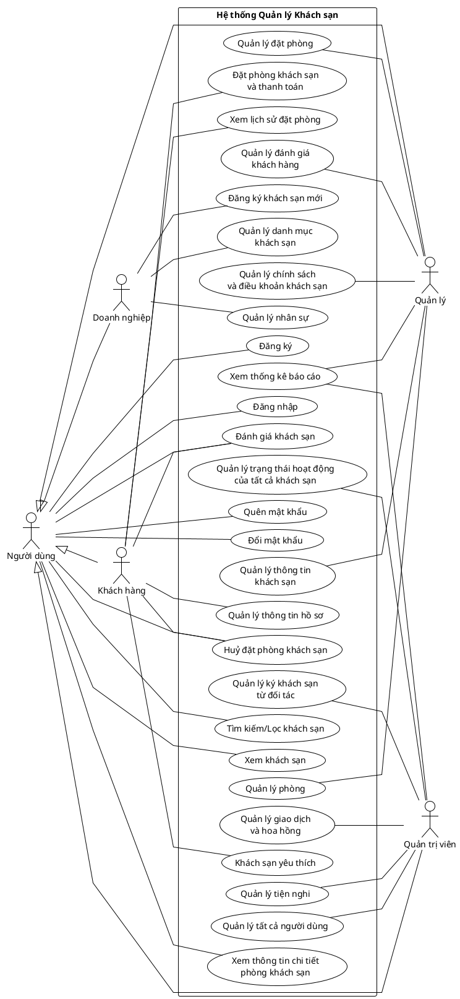

2

```plantuml
@startuml
!theme plain
skinparam shadowing false

' Cài đặt bắt buộc ép vào 1 trang để tối ưu khi xuất file
page 1x1
' Sử dụng left to right direction để dàn trang theo chiều ngang
left to right direction

' Tùy chỉnh đường nét mềm mại hơn
skinparam linetype polyline
' Ép sát khoảng cách dọc (nodesep) và nới rộng ngang (ranksep) để thành form A4
skinparam nodesep 10
skinparam ranksep 60

actor "Người dùng" as User
actor "Khách hàng" as Customer

actor "Doanh nghiệp" as Business
actor "Quản lý" as Manager
actor "Quản trị viên" as Admin

' Định nghĩa kế thừa (Mũi tên trỏ về Người dùng)
' Các Actor bên trái trỏ lên trên
Customer -up-|> User
Business -up-|> User
' Các Actor bên phải trỏ sang trái
Manager -left-|> User
Admin -left-|> User

rectangle "Hệ thống Quản lý Khách sạn" {
  
  ' Nhóm 1: Chức năng chung
  usecase "Đăng ký" as UC_Register
  usecase "Đăng nhập" as UC_Login
  usecase "Quên mật khẩu" as UC_Forgot_Password
  usecase "Đổi mật khẩu" as UC_Change_Password
  usecase "Tìm kiếm/Lọc khách sạn" as UC_Search_Filter
  usecase "Xem khách sạn" as UC_View_Hotel
  usecase "Xem thông tin chi tiết\nphòng khách sạn" as UC_View_Room_Detail

  ' Nhóm 2: Chức năng của Khách hàng
  usecase "Quản lý thông tin hồ sơ" as UC_Manage_Profile
  usecase "Khách sạn yêu thích" as UC_Favorite_Hotel
  usecase "Đánh giá khách sạn" as UC_Rate_Hotel
  usecase "Đặt phòng khách sạn\nvà thanh toán" as UC_Book_Pay
  usecase "Xem lịch sử đặt phòng" as UC_View_History
  usecase "Huỷ đặt phòng khách sạn" as UC_Cancel_Booking

  ' Nhóm 3: Chức năng của Doanh nghiệp
  usecase "Đăng ký khách sạn mới" as UC_Register_New_Hotel
  usecase "Quản lý danh mục\nkhách sạn" as UC_Manage_Hotel_Catalog
  usecase "Quản lý nhân sự" as UC_Manage_HR

  ' Nhóm 4: Chức năng của Quản lý
  usecase "Quản lý thông tin\nkhách sạn" as UC_Manage_Hotel_Info
  usecase "Quản lý phòng" as UC_Manage_Rooms
  usecase "Quản lý đặt phòng" as UC_Manage_Bookings
  usecase "Quản lý đánh giá\nkhách hàng" as UC_Manage_Customer_Reviews
  usecase "Quản lý chính sách\nvà điều khoản khách sạn" as UC_Manage_Policies

  ' Nhóm 5: Chức năng của Quản trị viên và báo cáo
  usecase "Xem thống kê báo cáo" as UC_View_Reports
  usecase "Quản lý tiện nghi" as UC_Manage_Facilities
  usecase "Quản lý giao dịch\nvà hoa hồng" as UC_Manage_Transactions
  usecase "Quản lý tất cả người dùng" as UC_Manage_All_Users
  usecase "Quản lý trạng thái hoạt động\ncủa tất cả khách sạn" as UC_Manage_Hotel_Status
  usecase "Quản lý ký khách sạn\ntừ đối tác" as UC_Manage_Partner_Contracts

  ' ======================================================
  ' TẠO LƯỚI USE CASE (GRID 3x9) ĐỂ TIẾT KIỆM KHÔNG GIAN DỌC
  ' Dàn đều 27 Use Case thành 3 cột, mỗi cột 9 Use case
  ' ======================================================
  
  ' Hàng 1
  UC_Register -[hidden]right-> UC_Register_New_Hotel
  UC_Register_New_Hotel -[hidden]right-> UC_Manage_Bookings

  ' Hàng 2
  UC_Login -[hidden]right-> UC_Manage_Hotel_Catalog
  UC_Manage_Hotel_Catalog -[hidden]right-> UC_Manage_Customer_Reviews

  ' Hàng 3
  UC_Forgot_Password -[hidden]right-> UC_Manage_HR
  UC_Manage_HR -[hidden]right-> UC_Manage_Policies

  ' Hàng 4
  UC_Change_Password -[hidden]right-> UC_Rate_Hotel
  UC_Rate_Hotel -[hidden]right-> UC_View_Reports

  ' Hàng 5
  UC_Search_Filter -[hidden]right-> UC_Book_Pay
  UC_Book_Pay -[hidden]right-> UC_Manage_Facilities

  ' Hàng 6
  UC_View_Hotel -[hidden]right-> UC_View_History
  UC_View_History -[hidden]right-> UC_Manage_Transactions

  ' Hàng 7
  UC_View_Room_Detail -[hidden]right-> UC_Cancel_Booking
  UC_Cancel_Booking -[hidden]right-> UC_Manage_All_Users

  ' Hàng 8
  UC_Manage_Profile -[hidden]right-> UC_Manage_Hotel_Info
  UC_Manage_Hotel_Info -[hidden]right-> UC_Manage_Hotel_Status

  ' Hàng 9
  UC_Favorite_Hotel -[hidden]right-> UC_Manage_Rooms
  UC_Manage_Rooms -[hidden]right-> UC_Manage_Partner_Contracts

}

' ======================================
' KẾT NỐI TỪ ACTOR ĐẾN USE CASE
' ======================================

' Từ Người dùng (Bên trái nối vào Cột 1 & 2)
User -- UC_Login
User -- UC_Register
User -- UC_Forgot_Password
User -- UC_Change_Password
User -- UC_Search_Filter
User -- UC_View_Hotel
User -- UC_View_Room_Detail
User -- UC_Rate_Hotel
User -- UC_Cancel_Booking

' Từ Khách hàng (Bên trái nối vào Cột 1 & 2)
Customer -- UC_Manage_Profile
Customer -- UC_Favorite_Hotel
Customer -- UC_Rate_Hotel
Customer -- UC_Book_Pay
Customer -- UC_View_History
Customer -- UC_Cancel_Booking

' Từ Doanh nghiệp (Bên trái nối vào Cột 2)
Business -- UC_Register_New_Hotel
Business -- UC_Manage_Hotel_Catalog
Business -- UC_Manage_HR

' ======================================
' ĐẢO NGƯỢC KẾT NỐI ĐỂ ĐẨY ACTOR SANG PHẢI
' ======================================

' Từ Quản lý (Bên phải nối vào Cột 2 & 3)
UC_Manage_Hotel_Info -- Manager
UC_Manage_Rooms -- Manager
UC_Manage_Bookings -- Manager
UC_Manage_Customer_Reviews -- Manager
UC_Manage_Policies -- Manager
UC_View_Reports -- Manager

' Từ Quản trị viên (Bên phải nối vào Cột 3)
UC_View_Reports -- Admin
UC_Manage_Facilities -- Admin
UC_Manage_Transactions -- Admin
UC_Manage_All_Users -- Admin
UC_Manage_Hotel_Status -- Admin
UC_Manage_Partner_Contracts -- Admin

@enduml
```
