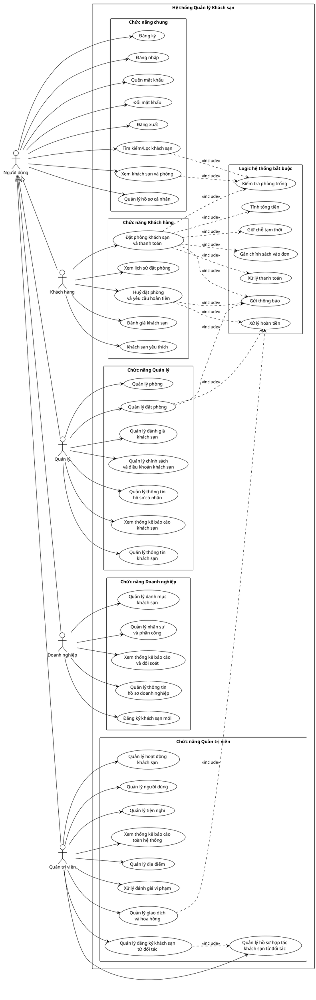

```plantuml
@startuml
!theme plain
left to right direction

actor "Người dùng" as User
actor "Khách hàng" as Customer
actor "Quản lý" as Manager
actor "Doanh nghiệp" as Business
actor "Quản trị viên" as Admin

Customer -up-|> User
Manager -up-|> User
Business -up-|> User
Admin -up-|> User

rectangle "Hệ thống Quản lý Khách sạn" {
  rectangle "Chức năng chung" {
    usecase "Đăng ký" as UC_Register
    usecase "Đăng nhập" as UC_Login
    usecase "Quên mật khẩu" as UC_Forgot_Password
    usecase "Đổi mật khẩu" as UC_Change_Password
    usecase "Đăng xuất" as UC_Logout
    usecase "Tìm kiếm/Lọc khách sạn" as UC_Search_Filter
    usecase "Xem khách sạn và phòng" as UC_View_Hotel_Room
    usecase "Quản lý hồ sơ cá nhân" as UC_Manage_Profile
  }

  rectangle "Chức năng Khách hàng" {
    usecase "Khách sạn yêu thích" as UC_Favorite_Hotel
    usecase "Đặt phòng khách sạn\nvà thanh toán" as UC_Book_Pay
    usecase "Xem lịch sử đặt phòng" as UC_View_History
    usecase "Huỷ đặt phòng\nvà yêu cầu hoàn tiền" as UC_Cancel_Refund
    usecase "Đánh giá khách sạn" as UC_Rate_Hotel
  }

  rectangle "Chức năng Quản lý" {
    usecase "Quản lý thông tin\nkhách sạn" as UC_Manage_Hotel_Info
    usecase "Quản lý phòng" as UC_Manage_Rooms
    usecase "Quản lý đặt phòng" as UC_Manage_Bookings
    usecase "Quản lý đánh giá\nkhách sạn" as UC_Manage_Hotel_Reviews
    usecase "Quản lý chính sách\nvà điều khoản khách sạn" as UC_Manage_Policies
    usecase "Quản lý thông tin\nhồ sơ cá nhân" as UC_Manager_Profile
    usecase "Xem thống kê báo cáo\nkhách sạn" as UC_Manager_Reports
  }

  rectangle "Chức năng Doanh nghiệp" {
    usecase "Đăng ký khách sạn mới" as UC_Register_New_Hotel
    usecase "Quản lý danh mục\nkhách sạn" as UC_Manage_Hotel_Catalog
    usecase "Quản lý nhân sự\nvà phân công" as UC_Manage_HR_Assignment
    usecase "Xem thống kê báo cáo\nvà đối soát" as UC_Business_Reports
    usecase "Quản lý thông tin\nhồ sơ doanh nghiệp" as UC_Business_Profile
  }

  rectangle "Chức năng Quản trị viên" {
    usecase "Quản lý đăng ký khách sạn\ntừ đối tác" as UC_Manage_Hotel_Registrations
    usecase "Quản lý giao dịch\nvà hoa hồng" as UC_Manage_Transactions
    usecase "Quản lý hoạt động\nkhách sạn" as UC_Manage_Hotel_Status
    usecase "Quản lý người dùng" as UC_Manage_All_Users
    usecase "Quản lý tiện nghi" as UC_Manage_Facilities
    usecase "Xem thống kê báo cáo\ntoàn hệ thống" as UC_Admin_Reports
    usecase "Quản lý địa điểm" as UC_Manage_Locations
    usecase "Quản lý hồ sơ hợp tác\nkhách sạn từ đối tác" as UC_Manage_Partner_Profiles
    usecase "Xử lý đánh giá vi phạm" as UC_Handle_Violating_Reviews
  }

  rectangle "Logic hệ thống bắt buộc" {
    usecase "Kiểm tra phòng trống" as UC_Check_Availability
    usecase "Giữ chỗ tạm thời" as UC_Temporary_Hold
    usecase "Tính tổng tiền" as UC_Calculate_Total
    usecase "Xử lý thanh toán" as UC_Process_Payment
    usecase "Xử lý hoàn tiền" as UC_Process_Refund
    usecase "Gửi thông báo" as UC_Send_Notification
    usecase "Gắn chính sách vào đơn" as UC_Attach_Policy
  }
}

User --> UC_Register
User --> UC_Login
User --> UC_Forgot_Password
User --> UC_Change_Password
User --> UC_Logout
User --> UC_Search_Filter
User --> UC_View_Hotel_Room
User --> UC_Manage_Profile

Customer --> UC_Favorite_Hotel
Customer --> UC_Book_Pay
Customer --> UC_View_History
Customer --> UC_Cancel_Refund
Customer --> UC_Rate_Hotel

Manager --> UC_Manage_Hotel_Info
Manager --> UC_Manage_Rooms
Manager --> UC_Manage_Bookings
Manager --> UC_Manage_Hotel_Reviews
Manager --> UC_Manage_Policies
Manager --> UC_Manager_Profile
Manager --> UC_Manager_Reports

Business --> UC_Register_New_Hotel
Business --> UC_Manage_Hotel_Catalog
Business --> UC_Manage_HR_Assignment
Business --> UC_Business_Reports
Business --> UC_Business_Profile

Admin --> UC_Manage_Hotel_Registrations
Admin --> UC_Manage_Transactions
Admin --> UC_Manage_Hotel_Status
Admin --> UC_Manage_All_Users
Admin --> UC_Manage_Facilities
Admin --> UC_Admin_Reports
Admin --> UC_Manage_Locations
Admin --> UC_Manage_Partner_Profiles
Admin --> UC_Handle_Violating_Reviews

UC_Search_Filter ..> UC_Check_Availability : <<include>>
UC_View_Hotel_Room ..> UC_Check_Availability : <<include>>
UC_Book_Pay ..> UC_Check_Availability : <<include>>
UC_Book_Pay ..> UC_Temporary_Hold : <<include>>
UC_Book_Pay ..> UC_Calculate_Total : <<include>>
UC_Book_Pay ..> UC_Process_Payment : <<include>>
UC_Book_Pay ..> UC_Attach_Policy : <<include>>
UC_Book_Pay ..> UC_Send_Notification : <<include>>
UC_Cancel_Refund ..> UC_Process_Refund : <<include>>
UC_Cancel_Refund ..> UC_Send_Notification : <<include>>
UC_Manage_Bookings ..> UC_Process_Refund : <<include>>
UC_Manage_Bookings ..> UC_Send_Notification : <<include>>
UC_Manage_Transactions ..> UC_Process_Refund : <<include>>
UC_Manage_Hotel_Registrations ..> UC_Manage_Partner_Profiles : <<include>>

@enduml
```
