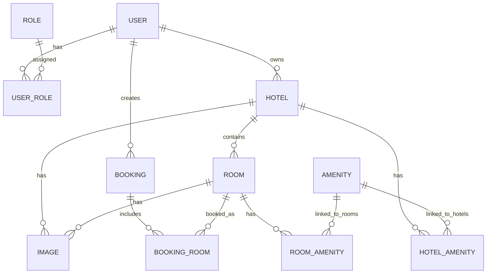

# Entity Schema - Hotel Booking

## 1. Metadata

| Field | Value |
| --- | --- |
| Document type | Entity Schema |
| Product | Hotel Booking |
| Purpose | Developer-friendly database reference for AI maintenance |
| Database | MySQL |

## 2. Entity Relationship Summary

## 3. Tables

### 3.1 `role`

| Column | Type | Required | Key | Notes |
| --- | --- | --- | --- | --- |
| `id` | `INT` | Yes | PK | Role ID |
| `name` | `VARCHAR(255)` | Yes | Unique recommended | Example: `ADMIN`, `CUSTOMER` |

### 3.2 `user`

| Column | Type | Required | Key | Notes |
| --- | --- | --- | --- | --- |
| `id` | `INT` | Yes | PK | User ID |
| `activate` | `BIT(1)` | Yes | Index recommended | Active/locked status; default `1` |
| `created_at` | `DATETIME(6)` | No | Index optional | Account creation time; default `CURRENT_TIMESTAMP(6)` |
| `dob` | `DATE` | Yes |  | Date of birth; API format `YYYY-MM-DD` |
| `email` | `VARCHAR(255)` | Yes | Unique | Login identifier; normalized lowercase |
| `full_name` | `VARCHAR(255)` | Yes |  | Full name |
| `password` | `VARCHAR(255)` | Yes |  | BCrypt hash |
| `phone` | `VARCHAR(20)` | Yes |  | VN phone number |

### 3.3 `user_role`

| Column | Type | Required | Key | Notes |
| --- | --- | --- | --- | --- |
| `role_id` | `INT` | Yes | PK, FK -> `role.id` | Role reference |
| `user_id` | `INT` | Yes | PK, FK -> `user.id` | User reference |

### 3.4 `hotel`

| Column | Type | Required | Key | Notes |
| --- | --- | --- | --- | --- |
| `id` | `INT` | Yes | PK | Hotel ID |
| `name` | `VARCHAR(255)` | Yes | Composite unique recommended with `location` | Hotel name |
| `description` | `VARCHAR(255)` | Yes |  | Hotel description |
| `location` | `VARCHAR(255)` | Yes | Index | Address/location |
| `phone` | `VARCHAR(20)` | Yes |  | Hotel phone |
| `email` | `VARCHAR(255)` | Yes |  | Hotel email |
| `contact_name` | `VARCHAR(255)` | Yes |  | Contact person |
| `contact_phone` | `VARCHAR(20)` | Yes |  | Contact phone |
| `star_rating` | `INT` | Yes |  | Hotel star rating |
| `is_active` | `BIT(1)` | Yes | Index recommended | Active/deleted state; default `1` |
| `user_id` | `INT` | Yes | FK -> `user.id` | Owner Admin |

### 3.5 `room`

| Column | Type | Required | Key | Notes |
| --- | --- | --- | --- | --- |
| `id` | `INT` | Yes | PK | Room ID |
| `name` | `VARCHAR(255)` | Yes |  | Room name/code |
| `type` | `ENUM('SINGLE','DOUBLE','TRIPLE','SUIT')` | Yes | Index recommended | Room type |
| `price` | `DECIMAL(15,2)` | Yes |  | Non-negative money value |
| `amount` | `INT` | Yes |  | Room quantity, must be > 0 |
| `capacity` | `INT` | Yes |  | Guest capacity, must be > 0 |
| `description` | `VARCHAR(255)` | Yes |  | Room description |
| `is_active` | `BIT(1)` | Yes | Index recommended | Active/deleted state; default `1` |
| `hotel_id` | `INT` | Yes | FK -> `hotel.id`, index | Parent hotel |

### 3.6 `image`

| Column | Type | Required | Key | Notes |
| --- | --- | --- | --- | --- |
| `id` | `INT` | Yes | PK | Image ID |
| `path` | `VARCHAR(1024)` | Yes |  | HTTPS Cloudinary/storage URL |
| `hotel_id` | `INT` | No | FK -> `hotel.id` | Set for hotel image |
| `room_id` | `INT` | No | FK -> `room.id` | Set for room image |

### 3.7 `booking`

| Column | Type | Required | Key | Notes |
| --- | --- | --- | --- | --- |
| `id` | `INT` | Yes | PK | Booking ID |
| `booking_reference` | `VARCHAR(10)` | Yes | Unique | Booking lookup code |
| `customer_name` | `VARCHAR(255)` | Yes |  | Customer name at booking time |
| `customer_phone` | `VARCHAR(20)` | Yes |  | Customer phone at booking time; validates with `VAL-PHONE-001` |
| `total_price` | `DECIMAL(15,2)` | Yes |  | Total booking price; calculated server-side |
| `status` | `ENUM('BOOKED','CHECKED_IN','CHECKED_OUT','CANCELLED')` | Yes | Index | Booking lifecycle status |
| `checkin_date` | `DATE` | Yes | Composite index recommended | Stay start date |
| `checkout_date` | `DATE` | Yes | Composite index recommended | Stay end date |
| `adult_amount` | `INT` | Yes |  | Number of adults |
| `children_amount` | `INT` | Yes |  | Number of children |
| `created_at` | `DATETIME(6)` | Yes | Index optional | Booking creation time; default `CURRENT_TIMESTAMP(6)` |
| `cancel_reason` | `VARCHAR(255)` | No |  | Cancellation reason |
| `refund` | `DECIMAL(15,2)` | No |  | Refund amount, payment flow not in MVP |
| `special_require` | `VARCHAR(255)` | No |  | Special request |
| `user_id` | `INT` | Yes | FK -> `user.id`, index | Booker |

### 3.8 `booking_room`

| Column | Type | Required | Key | Notes |
| --- | --- | --- | --- | --- |
| `id` | `INT` | Yes | PK | Mapping ID |
| `booking_id` | `INT` | Yes | FK -> `booking.id`, index | Booking reference |
| `room_id` | `INT` | Yes | FK -> `room.id`, index | Room reference |
| `quantity` | `INT` | Yes |  | Number of rooms booked for this room type; default `1`, must be > 0 |
| `room_number` | `VARCHAR(255)` | No | Index recommended with booking status | Physical room number(s) assigned at check-in; comma-separated when `quantity > 1` |

### 3.9 `amenity`

| Column | Type | Required | Key | Notes |
| --- | --- | --- | --- | --- |
| `id` | `INT` | Yes | PK | Amenity ID |
| `name` | `VARCHAR(255)` | Yes | Unique recommended | Amenity name |
| `type` | `ENUM('HOTEL_SERVICE','ROOM_FEATURE')` | Yes | Index recommended | Amenity type |

### 3.10 `hotel_amenity`

| Column | Type | Required | Key | Notes |
| --- | --- | --- | --- | --- |
| `amenity_id` | `INT` | Yes | PK, FK -> `amenity.id` | Amenity reference |
| `hotel_id` | `INT` | Yes | PK, FK -> `hotel.id` | Hotel reference |

### 3.11 `room_amenity`

| Column | Type | Required | Key | Notes |
| --- | --- | --- | --- | --- |
| `amenity_id` | `INT` | Yes | PK, FK -> `amenity.id` | Amenity reference |
| `room_id` | `INT` | Yes | PK, FK -> `room.id` | Room reference |

## 4. Relationship Rules

| Relationship | Rule |
| --- | --- |
| User -> Hotel | One Admin user can own many hotels. |
| User -> Booking | One Customer/Admin can create many bookings. |
| Hotel -> Room | One hotel contains many rooms. |
| Hotel/Room -> Image | Image belongs to either hotel or room; exactly one owner is recommended. |
| Booking -> Room | Booking links to room through `booking_room`. |
| Hotel/Room -> Amenity | Amenity links through mapping tables; deleting mapping must not delete amenity catalog row. |

## 5. Enum Catalog

| Enum | Values | Used By |
| --- | --- | --- |
| Role | `ADMIN`, `CUSTOMER` | `role.name` |
| RoomType | `SINGLE`, `DOUBLE`, `TRIPLE`, `SUIT` | `room.type` |
| BookingStatus | `BOOKED`, `CHECKED_IN`, `CHECKED_OUT`, `CANCELLED` | `booking.status` |
| AmenityType | `HOTEL_SERVICE`, `ROOM_FEATURE` | `amenity.type` |

## 6. Recommended Constraints

### 6.1 Data Format And Validation Constraints

| Validation ID | Entity/Column | Constraint |
| --- | --- | --- |
| VAL-ID-001 | All PK/FK IDs | Positive integer, min `1` |
| VAL-EMAIL-001 | `user.email`, `hotel.email` | Trim, lowercase before persistence; max length `255`; regex `^[A-Za-z0-9+_.-]+@[A-Za-z0-9.-]+\\.[A-Za-z]{2,}$` |
| VAL-PASSWORD-001 | `user.password` input before hash | Min length `8`, max length `72`; at least one letter and one digit; regex `^(?=.*[A-Za-z])(?=.*\\d).{8,72}$`; persist only BCrypt hash |
| VAL-PHONE-001 | `user.phone`, `hotel.phone`, `hotel.contact_phone`, `booking.customer_phone` | VN phone format; max length `20`; regex `^(0|\\+84)(2[0-9]{8,9}|[35789][0-9]{8})$` |
| VAL-DATE-001 | `user.dob`, `booking.checkin_date`, `booking.checkout_date` | API format `YYYY-MM-DD`; regex `^\\d{4}-\\d{2}-\\d{2}$` |
| VAL-MONEY-001 | `room.price`, `booking.total_price`, `booking.refund` | MySQL `DECIMAL(15,2)`; min `0`; max `9999999999999.99`; never use `FLOAT` or `DOUBLE` |
| VAL-IMAGE-001 | `image.path` | HTTPS URL only; max length `1024`; regex `^https://.{1,1016}$` |
| VAL-NAME-001 | `name`, `full_name`, `customer_name`, `contact_name` columns | Trim; min length `1`; max length `255`; required fields cannot be blank |
| VAL-TEXT-001 | `description`, `special_require`, `cancel_reason` | Trim; max length `255`; optional blank strings must be persisted as `NULL` |
| VAL-BOOK-REF-001 | `booking.booking_reference` | Uppercase alphanumeric; length `10`; regex `^[A-Z0-9]{10}$`; generated server-side |
| VAL-ROOM-NUMBER-001 | `booking_room.room_number` | Max length `255`; regex `^[A-Za-z0-9-,\s]{1,255}$`; required only when parent booking status becomes `CHECKED_IN`; comma-separated when `booking_room.quantity > 1` |

### 6.2 Default Values

| Entity/Column | Default | Rule |
| --- | --- | --- |
| `user.activate` | `1` | New account is active unless Admin locks it |
| `user.created_at` | `CURRENT_TIMESTAMP(6)` | Server-generated |
| `hotel.is_active` | `1` | New hotel is active |
| `room.is_active` | `1` | New room is active |
| `booking.status` | `BOOKED` | New booking lifecycle starts at `BOOKED` |
| `booking.created_at` | `CURRENT_TIMESTAMP(6)` | Server-generated; used by default pagination sort |
| `booking_room.quantity` | `1` | Must be set from booking request quantity when provided |
| `booking.refund` | `NULL` | MVP has no real refund calculation |
| `booking_room.room_number` | `NULL` | Set only during check-in |
| `booking.cancel_reason` | `NULL` | Required only when status becomes `CANCELLED` |

### 6.3 Database Constraints

| Constraint ID | Table | Constraint |
| --- | --- | --- |
| CONS-USER-001 | `user` | `email` unique |
| CONS-HOTEL-001 | `hotel` | unique composite `name + location` |
| CONS-ROOM-001 | `room` | `price >= 0` |
| CONS-ROOM-002 | `room` | `amount > 0` |
| CONS-ROOM-003 | `room` | `capacity > 0` |
| CONS-ROOM-004 | `room` | `is_active IN (0, 1)` |
| CONS-BOOK-001 | `booking` | `booking_reference` unique |
| CONS-BOOK-002 | `booking` | `checkout_date > checkin_date` |
| CONS-BOOK-003 | `booking` | `total_price >= 0` |
| CONS-BOOK-004 | `booking` | `refund IS NULL OR refund >= 0` |
| CONS-BOOK-ROOM-001 | `booking_room` | `quantity > 0` |
| CONS-BOOK-ROOM-002 | `booking_room` | Trong phạm vi MVP, mỗi `booking_id` chỉ được có duy nhất 1 bản ghi tương ứng trong bảng `booking_room` (Chỉ đặt 1 loại phòng trên 1 đơn hàng). |
| CONS-AMN-001 | `amenity` | `name` unique |
| CONS-HOTEL-AMN-001 | `hotel_amenity` | composite PK prevents duplicate link |
| CONS-ROOM-AMN-001 | `room_amenity` | composite PK prevents duplicate link |
| CONS-IMG-001 | `image` | exactly one of `hotel_id`, `room_id` should be non-null |

## 7. Recommended Indexes

| Index ID | Table | Columns | Purpose |
| --- | --- | --- | --- |
| IDX-USER-EMAIL | `user` | `email` | Login lookup |
| IDX-HOTEL-LOCATION | `hotel` | `location` | Hotel search |
| IDX-HOTEL-ACTIVE | `hotel` | `is_active` | Filter active hotels |
| IDX-HOTEL-OWNER | `hotel` | `user_id` | Admin-owned hotels |
| IDX-ROOM-HOTEL | `room` | `hotel_id` | Rooms by hotel |
| IDX-ROOM-TYPE | `room` | `type` | Type filtering |
| IDX-ROOM-ACTIVE | `room` | `is_active` | Filter active rooms |
| IDX-BOOK-REF | `booking` | `booking_reference` | Booking lookup |
| IDX-BOOK-USER | `booking` | `user_id` | Booking history |
| IDX-BOOK-CREATED | `booking` | `created_at` | Default list sort |
| IDX-BOOK-DATE-STATUS | `booking` | `status`, `checkin_date`, `checkout_date` | Availability check |
| IDX-BOOK-ROOM | `booking_room` | `room_id`, `booking_id` | Availability join |
| IDX-BOOK-ROOM-NUMBER | `booking_room` + `booking` | `booking_room.room_number`, `booking.status` | Check-in occupancy |

## 8. Delete Policy Recommendations

| Entity | Recommended Policy | Reason |
| --- | --- | --- |
| User | Soft delete (`is_active = 0`) AND append `_DELETED_{timestamp}` to unique columns (`email`, `name`) to prevent Unique Index constraints from blocking future records | Preserve booking history |
| Hotel | Soft delete (`is_active = 0`) AND append `_DELETED_{timestamp}` to unique columns (`email`, `name`) to prevent Unique Index constraints from blocking future records | Preserve room and booking history |
| Room | Soft delete (`is_active = 0`) AND append `_DELETED_{timestamp}` to unique columns (`email`, `name`) to prevent Unique Index constraints from blocking future records | Preserve booking history and availability audit |
| Booking | Never hard delete from normal UI | Preserve transaction/history |
| Amenity | Soft delete (`is_active = 0`) AND append `_DELETED_{timestamp}` to unique columns (`email`, `name`) to prevent Unique Index constraints from blocking future records | Catalog item can be hidden safely while preventing unique-name collisions |
| Mapping tables | Hard delete mapping | Removing link does not destroy original entity |

## 9. AI Maintenance Notes

| Task | Required Checks |
| --- | --- |
| Add new booking status | Update BookingStatus enum, state machine, API errors, availability rules, diagrams |
| Add payment | Add payment entity, update booking lifecycle, refund rules, API contract |
| Add reviews | Add review entity linked to user/booking/hotel/room, enforce completed booking rule |
| Add partner role | Split Admin permissions, update role matrix, owner checks, API access |
| Change delete behavior | Update schema policy, business rules, and all affected flows |
