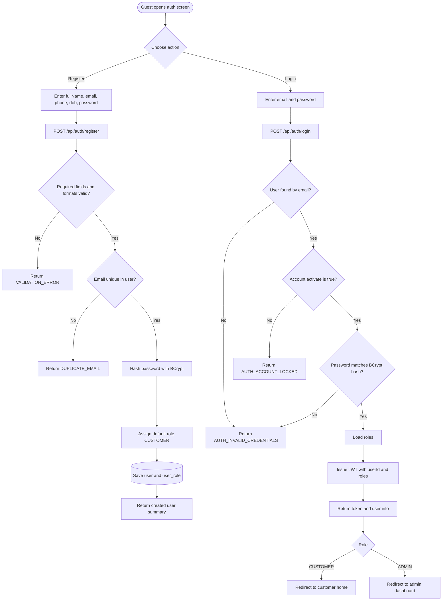
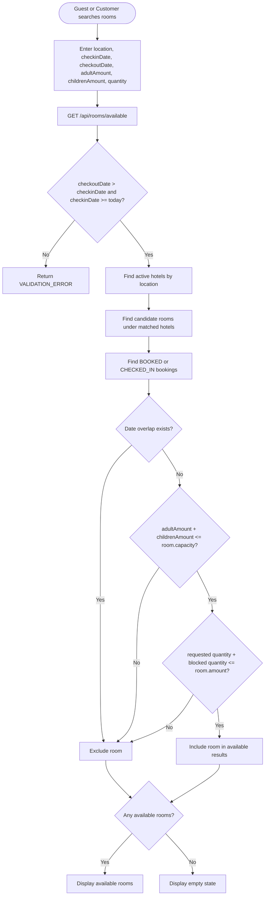
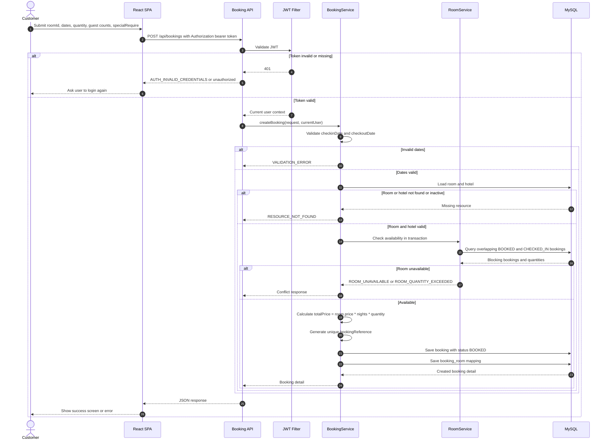
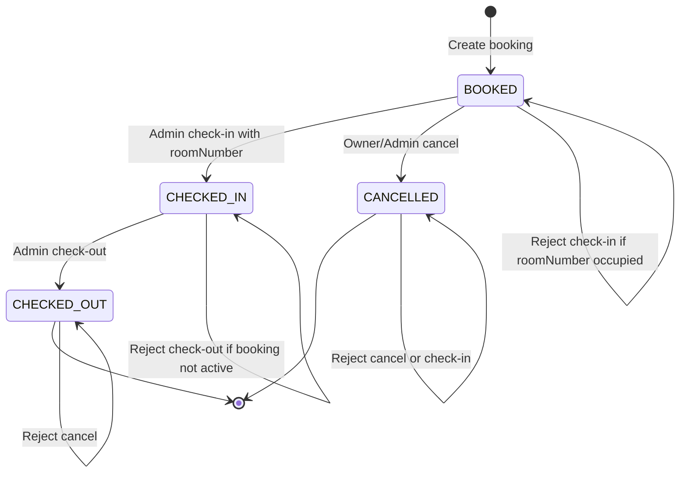
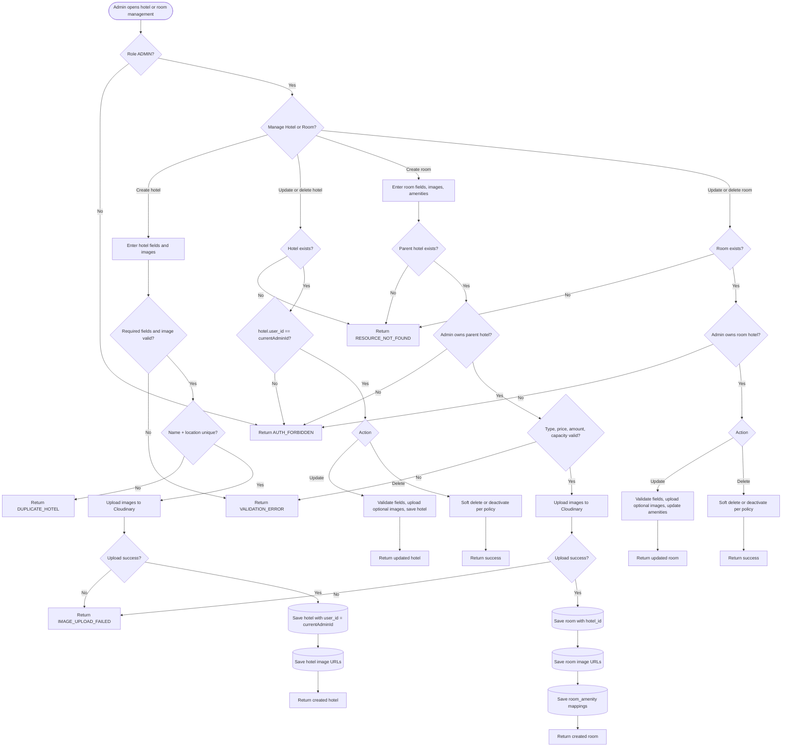
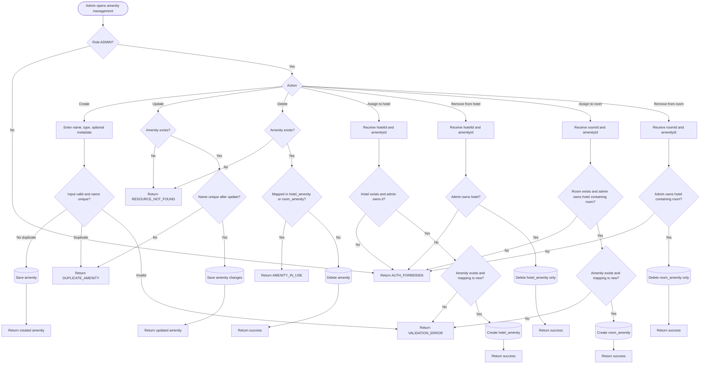
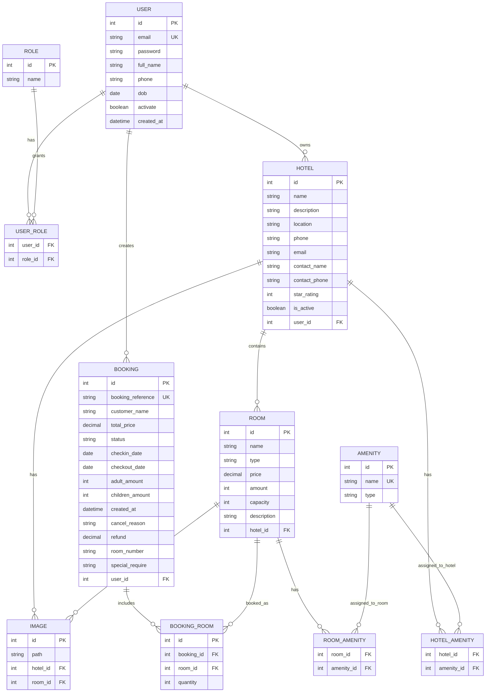

# Core Flow Diagrams - Hotel Booking

Source documents:

- `SDD/01-product/PRD.md`
- `SDD/03-technical/TECH_SPEC.md`
- `SDD/02-business/BUSINESS_PROCESS.md`
- `SDD/02-business/business-processes/*.md`

## 1. Login And Register



## 2. Search Availability



## 3. Create Booking



## 4. Cancel Booking

```mermaid
flowchart TD
    Start([Customer or Admin opens booking detail])
    Confirm[Show cancel confirmation and collect cancelReason]
    API[PATCH /api/bookings/{id}/cancel]
    Auth{JWT valid?}
    LoadBooking{Booking exists?}
    Permission{Actor is owner or ADMIN?}
    Status{Status can be cancelled?}
    SaveReason[Save cancel_reason]
    UpdateStatus[Set status to CANCELLED]
    ReturnUpdated[Return updated booking detail]
    Success[Show cancel success state]
    Unauthorized[Return unauthorized]
    NotFound[Return RESOURCE_NOT_FOUND]
    Forbidden[Return AUTH_FORBIDDEN]
    CannotCancel[Return BOOKING_CANNOT_CANCEL]

    Start --> Confirm --> API --> Auth
    Auth -->|No| Unauthorized
    Auth -->|Yes| LoadBooking
    LoadBooking -->|No| NotFound
    LoadBooking -->|Yes| Permission
    Permission -->|No| Forbidden
    Permission -->|Yes| Status
    Status -->|CHECKED_OUT or CANCELLED| CannotCancel
    Status -->|BOOKED| SaveReason --> UpdateStatus --> ReturnUpdated --> Success
    Status -->|CHECKED_IN| Policy{Policy allows cancel after check-in?}
    Policy -->|No or undefined| CannotCancel
    Policy -->|Admin exception| SaveReason
```

## 5. Admin Check-In And Check-Out



```mermaid
flowchart TD
    Start([Admin opens booking management])
    SelectAction{Operation}

    Start --> AdminAuth{Role ADMIN?}
    AdminAuth -->|No| Forbidden[Return AUTH_FORBIDDEN]
    AdminAuth -->|Yes| SelectAction

    SelectAction -->|Check-in| CheckInRequest[PATCH /api/admin/bookings/{id}/check-in with roomNumber]
    CheckInRequest --> LoadForCheckIn{Booking exists and status BOOKED?}
    LoadForCheckIn -->|No| StateError[Return RESOURCE_NOT_FOUND or state error]
    LoadForCheckIn -->|Yes| RoomNumberRequired{roomNumber provided?}
    RoomNumberRequired -->|No| ValidationError[Return VALIDATION_ERROR]
    RoomNumberRequired -->|Yes| Occupancy{roomNumber already assigned to active CHECKED_IN booking?}
    Occupancy -->|Yes| Occupied[Return ROOM_NUMBER_OCCUPIED]
    Occupancy -->|No| AssignRoom[Set booking.room_number]
    AssignRoom --> MarkCheckedIn[Set status CHECKED_IN]
    MarkCheckedIn --> ReturnCheckIn[Return updated booking]

    SelectAction -->|Check-out| CheckOutRequest[PATCH /api/admin/bookings/{id}/check-out]
    CheckOutRequest --> LoadForCheckOut{Booking exists and status CHECKED_IN?}
    LoadForCheckOut -->|No| StateError
    LoadForCheckOut -->|Yes| MarkCheckedOut[Set status CHECKED_OUT]
    MarkCheckedOut --> ReturnCheckOut[Return updated booking]
```

## 6. Admin Hotel And Room Management



## 7. Amenity Management



## 8. Entity Relationship Overview



## 9. Cross-Cutting Rules Represented

- Protected APIs require a valid JWT.
- Admin-only APIs require role `ADMIN`.
- Hotel, room, and amenity assignment changes require owner checks.
- Availability is blocked only by bookings in `BOOKED` or `CHECKED_IN`.
- Date overlap formula: `existing_checkin < new_checkout AND existing_checkout > new_checkin`.
- Booking creation, cancellation, check-in, check-out, and amenity delete checks should run in transaction boundaries.
- Hotel and room image files are uploaded to Cloudinary or equivalent storage; MySQL stores only URLs.
