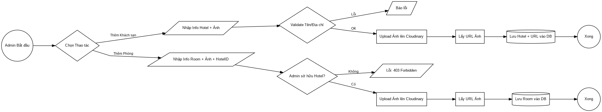
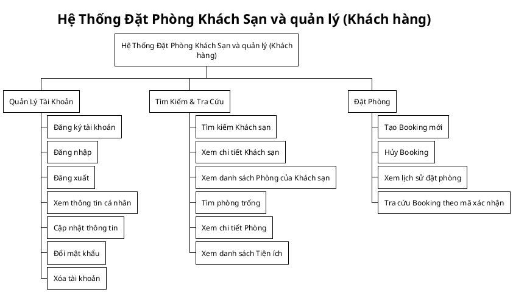
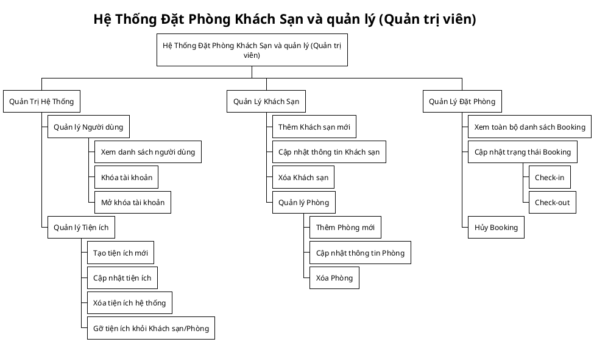
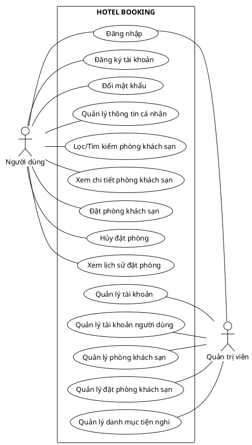

# Chương 3 — Phương pháp nghiên cứu

<!-- Nội dung dưới đây được nhập từ mục 2.3 của chương 2 cũ. Đây hiện là phần phân tích yêu cầu và quy trình nghiệp vụ; cần biên tập tiếp để phù hợp đầy đủ với cấu trúc phương pháp nghiên cứu trong OUTLINE.md. -->
## 2.3 Phân tích yêu cầu

### 2.3.1 Các quy trình, nghiệp vụ

#### 2.3.1.1 Quy trình Quản lý Tài khoản và Xác thực

- Quy trình bắt đầu khi người dùng mới thực hiện Đăng ký . Hệ thống tiếp nhận thông tin bao gồm họ tên, email, số điện thoại và ngày sinh. Trước khi tạo tài khoản, hệ thống sẽ kiểm tra trong cơ sở dữ liệu xem email đã tồn tại hay chưa để tránh trùng lặp. Mật khẩu người dùng nhập vào sẽ được mã hóa (sử dụng BCrypt) trước khi lưu trữ để đảm bảo bảo mật. Mặc định, tài khoản mới tạo sẽ được gán vai trò là "CUSTOMER" và trạng thái hoạt động được kích hoạt ngay lập tức.

- Đối với quy trình Đăng nhập (Login), người dùng cung cấp email và mật khẩu. Hệ thống tìm kiếm tài khoản theo email, sau đó kiểm tra xem tài khoản có đang bị khóa bởi Admin hay không. Nếu tài khoản hợp lệ, hệ thống so khớp mật khẩu đã mã hóa. Khi xác thực thành công, server sẽ sinh ra một chuỗi JWT chứa thông tin định danh và vai trò của người dùng, token này có hiệu lực trong 6 tháng và được dùng để xác thực các request tiếp theo.

- Ngoài ra, người dùng có thể thực hiện Đổi mật khẩu. Quy trình này yêu cầu người dùng phải nhập đúng mật khẩu cũ. Hệ thống cũng kiểm tra để đảm bảo mật khẩu mới không được trùng với mật khẩu cũ trước khi thực hiện mã hóa và cập nhật vào cơ sở dữ liệu.

```plantuml
@startdot
digraph Hinh_2_1 {
  graph [rankdir=LR, bgcolor="white", splines=polyline, nodesep=0.55, ranksep=0.75];
  node  [fontname="Arial", fontsize=10, color="black", fontcolor="black", style="solid", fillcolor="white"];
  edge  [fontname="Arial", fontsize=9, color="black", fontcolor="black", arrowsize=0.8];

  start [label="Bắt đầu", shape=circle, width=0.8, height=0.8];
  action [label="Chọn Hành động", shape=diamond, width=1.4, height=1.1];

  reg_in [label="Nhập: Tên, Email, SDT, DOB,\nPass", shape=parallelogram];
  email_exists [label="Email đã tồn tại?", shape=diamond, width=1.5, height=1.3];
  user_existed [label="Báo lỗi: User Existed", shape=parallelogram];
  hash [label="Mã hóa Mật khẩu BCrypt", shape=box];
  role [label="Gán Role: CUSTOMER", shape=box];
  save_user [label="Lưu User vào DB", shape=cylinder];
  reg_done [label="Hoàn tất", shape=circle, width=0.8, height=0.8];

  login_in [label="Nhập: Email, Pass", shape=parallelogram];
  find_user [label="Tìm User trong DB", shape=diamond, width=1.5, height=1.25];
  invalid [label="Báo lỗi: Sai thông tin", shape=parallelogram];
  locked [label="Tài khoản bị khóa?", shape=diamond, width=1.5, height=1.2];
  account_locked [label="Báo lỗi: Account Locked", shape=parallelogram];
  pass_ok [label="Mật khẩu khớp?", shape=diamond, width=1.45, height=1.2];
  jwt [label="Sinh JWT Token", shape=box];
  token_info [label="Trả về Token & User Info", shape=parallelogram];
  login_done [label="Hoàn tất", shape=circle, width=0.8, height=0.8];

  start -> action;
  action -> reg_in [label="Đăng Ký"];
  reg_in -> email_exists;
  email_exists -> user_existed [label="Có"];
  email_exists -> hash [label="Không"];
  hash -> role -> save_user -> reg_done;

  action -> login_in [label="Đăng Nhập"];
  login_in -> find_user;
  find_user -> invalid [label="Không thấy"];
  find_user -> locked [label="Thấy"];
  locked -> account_locked [label="Đúng"];
  account_locked -> invalid;
  locked -> pass_ok [label="Sai"];
  pass_ok -> invalid [label="Không"];
  pass_ok -> jwt [label="Có"];
  jwt -> token_info -> login_done;
}
@enddot
```

> Hình 2.1: Quy trình đăng nhập và đăng ký.

#### 2.3.1.2 Quy trình Quản lý Khách sạn và Phòng (Dành cho Admin)

- Quy trình này dành riêng cho tài khoản có quyền Admin. Đầu tiên là Tạo mới Khách sạn, Admin nhập các thông tin như tên, địa chỉ, mô tả, số sao và tải lên hình ảnh. Hệ thống tích hợp với Cloudinary để lưu trữ ảnh và lấy về URL lưu vào cơ sở dữ liệu. Hệ thống cũng kiểm tra tên và địa điểm khách sạn để ngăn chặn việc tạo trùng lặp.

- Sau khi có khách sạn, Admin tiến hành Thêm phòng . Một phòng sẽ được gắn liền với một khách sạn cụ thể do Admin quản lý. Admin thiết lập loại phòng (Single, Double, Suit, Triple), giá tiền, sức chứa và số lượng phòng có sẵn. Tương tự như khách sạn, hình ảnh phòng cũng được upload lên Cloud và liên kết với phòng đó. Đồng thời, Admin có thể gán các tiện ích cho phòng hoặc khách sạn từ danh sách tiện ích chung của hệ thống.

> Hình 2.2: Quy trình quản lý khách sạn và phòng

#### 2.3.1.3 Quy trình Tìm kiếm và Kiểm tra Phòng Trống

Đây là nghiệp vụ quan trọng để đảm bảo khách hàng luôn tìm được phòng thực tế có sẵn. Khi người dùng tìm kiếm theo địa điểm và khoảng thời gian (Check-in/Check-out), hệ thống thực hiện truy vấn phức tạp để loại trừ các phòng đã kín chỗ. Logic hoạt động là tìm tất cả các phòng thuộc khách sạn ở địa điểm đó, sau đó loại bỏ những phòng đã nằm trong các đơn đặt phòng (Booking) có trạng thái là BOOKED hoặc CHECKED_IN mà khoảng thời gian lưu trú giao nhau với khoảng thời gian khách đang tìm. Chỉ những phòng thỏa mãn điều kiện về thời gian và sức chứa mới được trả về kết quả tìm kiếm.

```plantuml
@startdot
digraph Hinh_2_3 {
  graph [rankdir=LR, bgcolor="white", splines=polyline, nodesep=0.5, ranksep=0.65];
  node  [fontname="Arial", fontsize=10, color="black", fontcolor="black", style="solid", fillcolor="white"];
  edge  [fontname="Arial", fontsize=9, color="black", fontcolor="black", arrowsize=0.8];

  start [label="Khách tìm kiếm", shape=circle, width=0.95, height=0.95];
  input [label="Nhập: Location, Dates, Số\nngười", shape=parallelogram];
  validate [label="Validate Ngày", shape=diamond, width=1.15, height=1.0];
  date_err [label="Báo lỗi ngày tháng", shape=parallelogram];
  hotels [label="Lấy Hotel theo Location", shape=cylinder];
  loop [label="Duyệt từng Phòng", shape=box, peripheries=2];

  conflict [label="Trùng lịch Booking?", shape=diamond, width=1.45, height=1.25];
  skip [label="Bỏ qua phòng này", shape=box];
  capacity [label="Đủ sức chứa?", shape=diamond, width=1.25, height=1.05];
  add [label="Thêm vào Danh sách", shape=box];
  has_room [label="Còn phòng?", shape=diamond, width=1.05, height=0.9];
  result [label="Trả về danh sách Phòng trống", shape=parallelogram];
  end [label="Kết thúc", shape=circle, width=0.9, height=0.9];

  start -> input -> validate;
  validate -> date_err [label="Sai"];
  validate -> hotels [label="Đúng"];
  hotels -> loop;
  loop -> conflict;

  conflict -> skip [label="Có"];
  conflict -> capacity [label="Không"];
  capacity -> skip [label="Không"];
  capacity -> add [label="Có"];
  skip -> has_room;
  add -> has_room;

  has_room -> loop [label="Có"];
  has_room -> result [label="Không"];
  result -> end;
}
@enddot
```

> Hình 2.3: Quy trình tìm kiếm và kiểm tra phòng trống

#### 2.3.1.4 Quy trình Đặt phòng

- Quy trình đặt phòng diễn ra qua nhiều bước kiểm tra nghiêm ngặt. Khi khách hàng gửi yêu cầu đặt phòng, hệ thống đầu tiên sẽ xác thực tính hợp lệ của ngày tháng (ngày Check-in không được là quá khứ, ngày Check-out phải sau ngày Check-in). Tiếp theo, hệ thống kiểm tra lại một lần nữa số lượng phòng trống thực tế trong khoảng thời gian đó. Nếu tổng số phòng đã đặt cộng với số phòng khách muốn đặt vượt quá tổng số lượng phòng hiện có của khách sạn, yêu cầu sẽ bị từ chối.

- Nếu phòng có sẵn, hệ thống sẽ tính toán tổng giá tiền bằng cách nhân giá phòng với số đêm lưu trú. Một mã đặt phòng duy nhất gồm 10 ký tự sẽ được sinh ra ngẫu nhiên. Đơn đặt phòng sau đó được lưu vào cơ sở dữ liệu với trạng thái ban đầu là BOOKED.

```plantuml
@startdot
digraph Hinh_2_4 {
  graph [rankdir=LR, bgcolor="white", splines=polyline, nodesep=0.55, ranksep=0.75];
  node  [fontname="Arial", fontsize=11, color="black", fontcolor="black", style="solid", fillcolor="white"];
  edge  [fontname="Arial", fontsize=10, color="black", fontcolor="black", arrowsize=0.8];

  start [label="User Đặt phòng", shape=circle];
  req [label="Gửi Request: RoomID, Date,\nQty", shape=parallelogram];
  dateok [label="Ngày hợp lệ?", shape=diamond];
  dateerr [label="Lỗi ngày tháng", shape=parallelogram];

  check [label="Check Hotel/Room ID", shape=diamond];
  dataerr [label="Lỗi dữ liệu", shape=parallelogram];

  count [label="Đếm số phòng đã đặt", shape=cylinder];
  available [label="Còn đủ phòng?", shape=diamond];
  full [label="Báo lỗi: Hết phòng", shape=parallelogram];

  total [label="Tính Tổng tiền", shape=box];
  booking [label="Sinh Mã Booking", shape=box];
  save [label="Lưu Booking (Status=BOOKED)", shape=cylinder];
  resp [label="Trả về thông tin Booking", shape=parallelogram];
  done [label="Hoàn tất", shape=circle];

  start -> req;
  req -> dateok;
  dateok -> dateerr [label="Không"];
  dateok -> check [label="Có"];
  check -> dataerr [label="Sai"];
  check -> count [label="Đúng"];
  count -> available;
  available -> full [label="Không"];
  available -> total [label="Có"];
  total -> booking;
  booking -> save;
  save -> resp;
  resp -> done;
}
@enddot
```

> Hình 2.4: Quy trình đặt phòng

#### 2.3.1.5 Quy trình Vận hành

- Sau khi đơn đặt phòng được tạo, quy trình vận hành cho phép cập nhật trạng thái. Khi khách đến nhận phòng, Admin hoặc lễ tân sẽ cập nhật trạng thái đơn sang CHECKED_IN. Tại bước này, hệ thống cho phép gán số phòng cụ thể (ví dụ: phòng 301) cho khách. Hệ thống có logic kiểm tra để đảm bảo số phòng này chưa bị gán cho một khách đang lưu trú khác.

- Đối với việc Hủy phòng, người dùng hoặc Admin có thể thực hiện. Tuy nhiên, hệ thống chặn việc hủy đối với các đơn đã hoàn thành (CHECKED_OUT) hoặc đã bị hủy trước đó. Chỉ người dùng tạo đơn (chính chủ) hoặc Admin mới có quyền thực hiện thao tác này.

```plantuml
@startdot
digraph Hinh_2_5 {
  graph [rankdir=LR, bgcolor="white", splines=polyline, nodesep=0.55, ranksep=0.95];
  node  [fontname="Arial", fontsize=11, color="black", fontcolor="black", style="solid", fillcolor="white"];
  edge  [fontname="Arial", fontsize=10, color="black", fontcolor="black", arrowsize=0.8];

  start [label="Bắt đầu", shape=circle];
  choose [label="Chọn hành động", shape=diamond];

  cancelReq [label="Yêu cầu Hủy (BookingID)", shape=parallelogram];
  auth [label="Là Admin hoặc Chủ đơn?", shape=diamond];
  unauthorized [label="Lỗi: Unauthorized", shape=parallelogram];
  status [label="Trạng thái hợp lệ?", shape=diamond];
  cannotCancel [label="Lỗi: Không thể hủy", shape=parallelogram];
  cancelUpdate [label="Cập nhật: CANCELLED", shape=cylinder];
  done1 [label="Xong", shape=circle];

  checkinReq [label="Yêu cầu Check-in (Admin)", shape=parallelogram];
  roomInput [label="Nhập số phòng (Ví dụ: 301)", shape=box];
  busy [label="Phòng đang có khách?", shape=diamond];
  busyErr [label="Lỗi: Phòng đang bận", shape=parallelogram];
  checkinUpdate [label="Cập nhật: CHECKED_IN", shape=cylinder];
  done2 [label="Xong", shape=circle];

  start -> choose;

  choose -> cancelReq [label="Hủy phòng"];
  cancelReq -> auth;
  auth -> unauthorized [label="Không"];
  auth -> status [label="Có"];
  status -> cannotCancel [label="Đã xong/Hủy"];
  status -> cancelUpdate [label="OK"];
  cancelUpdate -> done1;

  choose -> checkinReq [label="Check-in"];
  checkinReq -> roomInput;
  roomInput -> busy;
  busy -> busyErr [label="Có"];
  busy -> checkinUpdate [label="Không"];
  checkinUpdate -> done2;
}
@enddot
```

> Hình 2.5: Quy trình vận hành

### 2.3.2 Sơ đồ chức năng

> Hình 2.6: Sơ đồ chức năng của khách hàng

> Hình 2.7: Sơ đồ chức năng của quản trị viên

### 2.3.3 Sơ đồ Use case tổng quát

> Hình 2.8: Sơ đồ Usecase tổng quát
