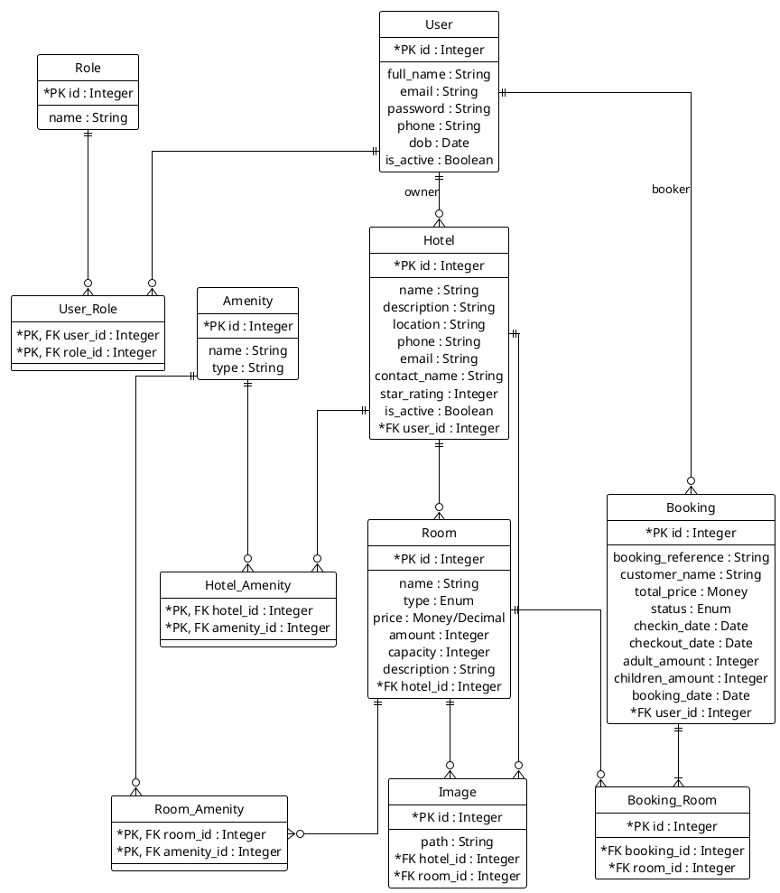
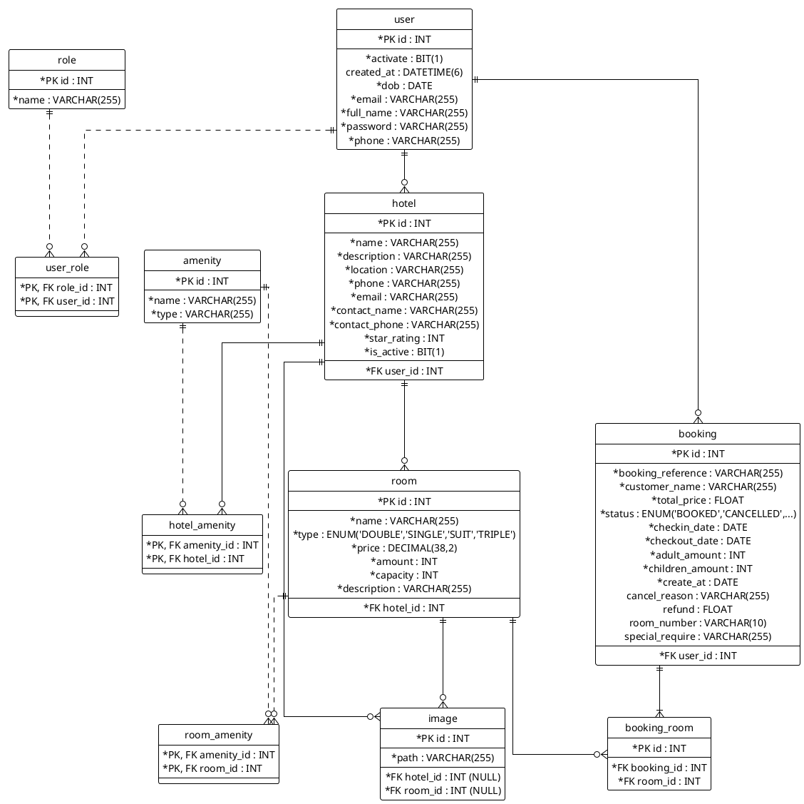

<ai_context>
File này là mảnh Level-2 thuộc Chương 3, mục 3.1. Chứa mô hình dữ liệu mức ý niệm, mức luận lý và mức vật lý của hệ thống đặt phòng khách sạn; các khối PlantUML trong file là nguồn đối chiếu chính cho ERD, bảng dữ liệu và quan hệ dữ liệu.
</ai_context>

<system_instruction>
TUYỆT ĐỐI KHÔNG tự ý thay đổi, xóa, định dạng lại mã nguồn PlantUML hoặc code fence trừ khi tác vụ yêu cầu đích danh việc sửa mô hình dữ liệu. Khi sửa sơ đồ dữ liệu, phải đối chiếu dependencies trước và bảo toàn PK/FK, cardinality, tên bảng/cột, kiểu dữ liệu, quan hệ luận lý/vật lý và caption hình nếu không có yêu cầu rõ ràng.
</system_instruction>

## 3.1 Mô hình dữ liệu (mức ý niệm, mức luận lý, mức vật lý)

### 3.1.1 Mức ý niệm

> Hình 2.9: Mô hình dữ liệu mức ý niệm

### 3.1.2 Mức luận lý

> Hình 2.10: Mô hình dữ liệu mức luận lý
### 3.1.3 Mức vật lý

> Hình 2.11: Mô hình dữ liệu mức vật lý
### 3.1.4 Mô tả chi tiết bảng

Bảng Role

| Thuộc tính | Giải thích | Kiểu dữ liệu | K | U | M |
| --- | --- | --- | --- | --- | --- |
| id | Mã định danh của quyền | INT | x | x | x |
| name | Tên quyền hạn (ví dụ: ADMIN) | VARCHAR(255) |  |  | x |

Bảng User

| Thuộc tính | Giải thích | Kiểu dữ liệu | K | U | M |
| --- | --- | --- | --- | --- | --- |
| id | Mã định danh người dùng | INT | x | x | x |
| activate | Trạng thái kích hoạt (1: Active, 0: Inactive) | BIT(1) |  |  | x |
| created_at | Thời gian tạo tài khoản | DATETIME(6) |  |  |  |
| dob | Ngày sinh | DATE |  |  | x |
| email | Địa chỉ email | VARCHAR(255) |  |  | x |
| full_name | Họ và tên đầy đủ | VARCHAR(255) |  |  | x |
| password | Mật khẩu (đã mã hóa) | VARCHAR(255) |  |  | x |
| phone | Số điện thoại | VARCHAR(255) |  |  | x |

Bảng Hotel

| Thuộc tính | Giải thích | Kiểu dữ liệu | K | U | M |
| --- | --- | --- | --- | --- | --- |
| id | Mã định danh khách sạn | INT | x | x | x |
| name | Tên khách sạn | VARCHAR(255) |  |  | x |
| description | Mô tả về khách sạn | VARCHAR(255) |  |  | x |
| location | Địa chỉ/Vị trí | VARCHAR(255) |  |  | x |
| star_rating | Xếp hạng sao (ví dụ: 3, 4, 5) | INT |  |  | x |
| contact_name | Tên người liên hệ | VARCHAR(255) |  |  | x |
| contact_phone | Số điện thoại liên hệ | VARCHAR(255) |  |  | x |
| email | Email của khách sạn | VARCHAR(255) |  |  | x |
| is_active | Trạng thái hoạt động | BIT(1) |  |  | x |
| user_id | Mã người dùng sở hữu (FK) | INT |  |  | x |

Bảng Room

| Thuộc tính | Giải thích | Kiểu dữ liệu | K | U | M |
| --- | --- | --- | --- | --- | --- |
| id | Mã định danh phòng | INT | x | x | x |
| name | Tên phòng/Mã phòng | VARCHAR(255) |  |  | x |
| type | Loại phòng (DOUBLE, SINGLE, SUIT, TRIPLE) | ENUM |  |  | x |
| price | Giá phòng | DECIMAL(38,2) |  |  | x |
| capacity | Sức chứa (số người) | INT |  |  | x |
| amount | Số lượng phòng loại này | INT |  |  | x |
| description | Mô tả chi tiết phòng | VARCHAR(255) |  |  | x |
| hotel_id | Thuộc khách sạn nào (FK) | INT |  |  | x |

Bảng Booking

| Thuộc tính | Giải thích | Kiểu dữ liệu | K | U | M |
| --- | --- | --- | --- | --- | --- |
| id | Mã đơn đặt phòng | INT | x | x | x |
| booking_reference | Mã tham chiếu đặt phòng | VARCHAR(255) |  |  | x |
| customer_name | Tên khách hàng đặt | VARCHAR(255) |  |  | x |
| checkin_date | Ngày nhận phòng | DATE |  |  | x |
| checkout_date | Ngày trả phòng | DATE |  |  | x |
| create_at | Ngày tạo đơn | DATE |  |  | x |
| total_price | Tổng giá trị đơn hàng | FLOAT |  |  | x |
| status | Trạng thái (BOOKED, CANCELLED...) | ENUM |  |  | x |
| adult_amount | Số lượng người lớn | INT |  |  | x |
| children_amount | Số lượng trẻ em | INT |  |  | x |
| user_id | Người dùng thực hiện đặt (FK) | INT |  |  | x |
| cancel_reason | Lý do hủy (nếu có) | VARCHAR(255) |  |  |  |
| refund | Số tiền hoàn lại (nếu có) | FLOAT |  |  |  |
| room_number | Số phòng được gán | VARCHAR(10) |  |  |  |
| special_require | Yêu cầu đặc biệt | VARCHAR(255) |  |  |  |

Bảng Amenity

| Thuộc tính | Giải thích | Kiểu dữ liệu | K | U | M |
| --- | --- | --- | --- | --- | --- |
| id | Mã tiện nghi | INT | x | x | x |
| name | Tên tiện nghi | VARCHAR(255) |  |  | x |
| type | Loại tiện nghi | VARCHAR(255) |  |  | x |

Bảng Image

| Thuộc tính | Giải thích | Kiểu dữ liệu | K | U | M |
| --- | --- | --- | --- | --- | --- |
| id | Mã hình ảnh | INT | x | x | x |
| path | Đường dẫn lưu file ảnh | VARCHAR(255) |  |  | x |
| hotel_id | Ảnh thuộc khách sạn nào (FK) | INT |  |  |  |
| room_id | Ảnh thuộc phòng nào (FK) | INT |  |  |  |

Bảng Booking_room

| Thuộc tính | Giải thích | Kiểu dữ liệu | K | U | M |
| --- | --- | --- | --- | --- | --- |
| id | Mã chi tiết | INT | x | x | x |
| booking_id | Mã đơn đặt (FK) | INT |  |  | x |
| room_id | Mã phòng (FK) | INT |  |  | x |

Bảng Hotel_Amenity

| Thuộc tính | Giải thích | Kiểu dữ liệu | K | U | M |
| --- | --- | --- | --- | --- | --- |
| amenity_id | Mã tiện nghi (FK) | INT | x |  | x |
| hotel_id | Mã khách sạn (FK) | INT | x |  | x |

Bảng Room_Amenity

| Thuộc tính | Giải thích | Kiểu dữ liệu | K | U | M |
| --- | --- | --- | --- | --- | --- |
| amenity_id | Mã tiện nghi (FK) | INT | x |  | x |
| room_id | Mã phòng (FK) | INT | x |  | x |

Bảng User_Role

| Thuộc tính | Giải thích | Kiểu dữ liệu | K | U | M |
| --- | --- | --- | --- | --- | --- |
| role_id | Mã quyền (FK) | INT | x |  | x |
| user_id | Mã người dùng (FK) | INT | x |  | x |
