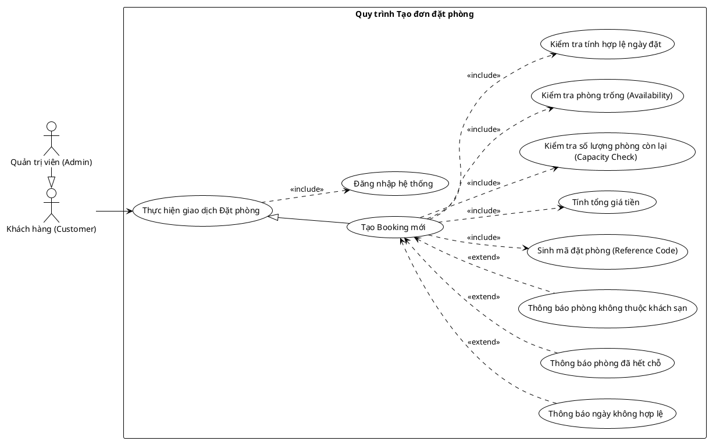

<!-- Mảnh Level-3 được tạo từ mục 3.2. Theo MEGA-DOCUMENT PROTOCOL, chỉnh sửa mặc định phải thực hiện tại mảnh này. Không tự ý chỉnh sửa PlantUML/code fence nếu tác vụ không yêu cầu. -->

#### 3.2.1.10 Usecase đặt phòng

> Hình 3.10: Usecase quản lý đặt phòng

Đặc tả Usecase tạo booking mới

| Mục | Nội dung |
| --- | --- |
| Tên Use case | Tạo Booking mới |
| Actor | Khách hàng (Customer), Quản trị viên (Admin) |
| Mô tả | Người dùng thực hiện quy trình tạo một đơn đặt phòng mới, bao gồm việc chọn thời gian, kiểm tra phòng trống và xác nhận thanh toán để hệ thống ghi nhận giao dịch. |
| Pre-conditions | - Actor đã đăng nhập vào hệ thống. - Actor đang ở trang chi tiết phòng hoặc giao diện đặt phòng. |
| Post-conditions | Success: Đơn đặt phòng được tạo thành công, mã đặt phòng (Reference Code) được sinh ra. Fail: Hệ thống hiển thị thông báo lỗi cụ thể và không tạo đơn. |
| Luồng sự kiện chính | 1. Actor chọn ngày check-in, check-out và số lượng phòng cần đặt. 2. Actor nhấn nút "Đặt phòng". 3. Hệ thống thực hiện kiểm tra tính hợp lệ ngày đặt. 4. Hệ thống thực hiện kiểm tra phòng trống. 5. Hệ thống thực hiện kiểm tra số lượng phòng còn lại. 6. Hệ thống thực hiện tính tổng giá tiền. 7. Hệ thống thực hiện sinh mã đặt phòng. 8. Hệ thống lưu thông tin đơn hàng và thông báo đặt phòng thành công. |
| Luồng sự kiện phụ | - Nếu ngày check-in/check-out sai quy tắc: Hệ thống thực hiện thông báo ngày không hợp lệ. - Nếu phòng không còn trống trong khoảng thời gian chọn: Hệ thống thực hiện thông báo phòng đã hết chỗ. - Nếu có lỗi liên quan đến dữ liệu khách sạn: Hệ thống thực hiện thông báo phòng không thuộc khách sạn. |
| <Include Use Case> Quy trình Nghiệp vụ | - Kiểm tra tính hợp lệ ngày đặt: Hệ thống xác nhận ngày check-in phải trước ngày check-out và lớn hơn hoặc bằng ngày hiện tại. - Kiểm tra phòng trống: Hệ thống truy vấn cơ sở dữ liệu để đảm bảo phòng chưa được đặt trong khoảng thời gian khách chọn. - Kiểm tra số lượng phòng: Hệ thống xác minh sức chứa (Capacity) còn lại của loại phòng đó. - Tính tổng giá tiền: Hệ thống tự động tính toán chi phí dựa trên đơn giá phòng và số ngày lưu trú. - Sinh mã đặt phòng: Hệ thống tạo ra một mã tham chiếu duy nhất (Reference Code) để định danh cho đơn đặt phòng này. |
| <Extend Use Case> Các trường hợp ngoại lệ | Thông báo ngày không hợp lệ: - Điều kiện: Khi ngày nhập vào vi phạm logic nghiệp vụ. - Hành động: Hệ thống hiển thị lỗi "Ngày đặt không hợp lệ" và yêu cầu chọn lại. Thông báo phòng đã hết chỗ: - Điều kiện: Khi kết quả kiểm tra phòng trống trả về False. - Hành động: Hệ thống báo lỗi "Phòng đã hết chỗ trong khoảng thời gian này". Thông báo phòng không thuộc khách sạn: - Điều kiện: Khi dữ liệu phòng và khách sạn không khớp (lỗi dữ liệu hệ thống). - Hành động: Hệ thống hiển thị thông báo lỗi kỹ thuật tương ứng. |
