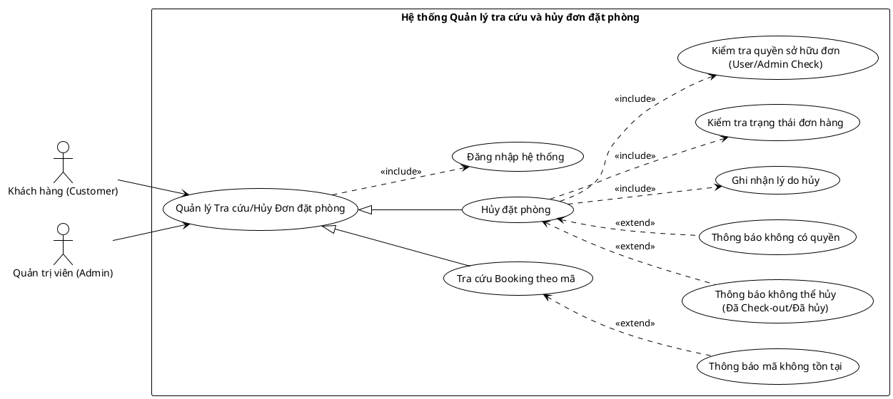

<!-- Mảnh Level-3 được tạo từ mục 3.2. Theo MEGA-DOCUMENT PROTOCOL, chỉnh sửa mặc định phải thực hiện tại mảnh này. Không tự ý chỉnh sửa PlantUML/code fence nếu tác vụ không yêu cầu. -->

#### 3.2.1.11 Usecase tra cứu và hủy đơn đặt phòng

> Hình 3.11: Usecase tra cứu và hủy đơn đặt phòng

Đặc tả Usecase tra cứu Booking theo mã

| Mục | Nội dung |
| --- | --- |
| Tên Use case | Tra cứu Booking theo mã |
| Actor | Khách hàng (Customer), Quản trị viên (Admin) |
| Mô tả | Người dùng tìm kiếm và xem chi tiết thông tin của một đơn đặt phòng cụ thể dựa trên mã đặt phòng (Reference Code) đã được cấp trước đó. |
| Pre-conditions | - Actor đã đăng nhập vào hệ thống. - Actor có mã đặt phòng cần tra cứu. |
| Post-conditions | Success: Hệ thống hiển thị đầy đủ thông tin chi tiết của đơn đặt phòng. Fail: Hệ thống thông báo không tìm thấy đơn hàng. |
| Luồng sự kiện chính | 1. Actor truy cập trang tra cứu. 2. Actor nhập mã đặt phòng (Reference Code). 3. Actor nhấn nút "Tìm kiếm". 4. Hệ thống thực hiện truy vấn đơn hàng trong cơ sở dữ liệu. 5. Nếu mã hợp lệ, hệ thống hiển thị thông tin chi tiết của Booking. 6. Hệ thống thực hiện kiểm tra quyền truy cập (ẩn danh tính nếu không phải chủ sở hữu - tùy nghiệp vụ). |
| Luồng sự kiện phụ | - Nếu mã đặt phòng không tồn tại trong hệ thống: Hệ thống thực hiện thông báo mã không tồn tại. |
| <Include Use Case> Quy trình Nghiệp vụ | - Đăng nhập: (Kế thừa từ Parent) Đảm bảo người dùng đã xác thực danh tính trước khi thực hiện tra cứu. |
| <Extend Use Case> Thông báo mã không tồn tại | Điều kiện: Khi kết quả truy vấn cơ sở dữ liệu trả về rỗng. Hành động: - Hệ thống hiển thị thông báo: "Mã đặt phòng không tồn tại". - Hệ thống yêu cầu người dùng kiểm tra và nhập lại. |

Đặc tả Usecase hủy đặt phòng

| Mục | Nội dung |
| --- | --- |
| Tên Use case | Hủy đặt phòng (Cancel Booking) |
| Actor | Khách hàng (Customer), Quản trị viên (Admin) |
| Mô tả | Người dùng thực hiện hủy một đơn đặt phòng đã đặt. Hệ thống cần kiểm tra các điều kiện về quyền hạn và trạng thái đơn hàng trước khi cho phép hủy. |
| Pre-conditions | - Actor đã đăng nhập. - Đơn đặt phòng đã được tìm thấy và đang hiển thị chi tiết. - Đơn hàng chưa Check-out hoặc chưa bị hủy trước đó. |
| Post-conditions | Success: Trạng thái đơn hàng chuyển sang "Cancelled", lý do hủy được ghi nhận. Fail: Hệ thống báo lỗi và giữ nguyên trạng thái đơn hàng. |
| Luồng sự kiện chính | 1. Actor nhấn nút "Hủy đặt phòng" trên giao diện chi tiết đơn hàng. 2. Actor nhập lý do hủy (tùy chọn hoặc bắt buộc). 3. Actor xác nhận hành động hủy. 4. Hệ thống thực hiện kiểm tra quyền sở hữu đơn. 5. Hệ thống thực hiện kiểm tra trạng thái đơn hàng. 6. Nếu hợp lệ, hệ thống thực hiện ghi nhận lý do hủy. 7. Hệ thống cập nhật trạng thái đơn hàng thành "Đã hủy" và thông báo thành công. |
| Luồng sự kiện phụ | - Nếu đơn hàng đã hoàn thành hoặc đã hủy trước đó: Hệ thống thực hiện thông báo không thể hủy. - Nếu Actor cố tình hủy đơn hàng không phải của mình (và không phải Admin): Hệ thống thực hiện thông báo không có quyền. |
| <Include Use Case> Quy trình Kiểm tra & Xử lý | - Kiểm tra quyền sở hữu: Hệ thống đối chiếu ID người dùng hiện tại với ID người đặt của đơn hàng (hoặc check quyền Admin). - Kiểm tra trạng thái: Hệ thống đảm bảo đơn hàng đang ở trạng thái cho phép hủy (ví dụ: "Confirmed" hoặc "Pending"). - Ghi nhận lý do: Hệ thống lưu trữ lý do hủy vào lịch sử đơn hàng để phục vụ thống kê hoặc CSKH. |
| <Extend Use Case> Thông báo không thể hủy | Điều kiện: Khi đơn hàng đang ở trạng thái Checked-out hoặc Cancelled. Hành động: - Hệ thống hiển thị lỗi: "Đơn hàng này không thể hủy vì đã hoàn tất hoặc đã bị hủy". |
| <Extend Use Case> Thông báo không có quyền | Điều kiện: Khi quy trình kiểm tra quyền sở hữu thất bại. Hành động: - Hệ thống hiển thị cảnh báo bảo mật: "Bạn không có quyền thao tác trên đơn hàng này". |
