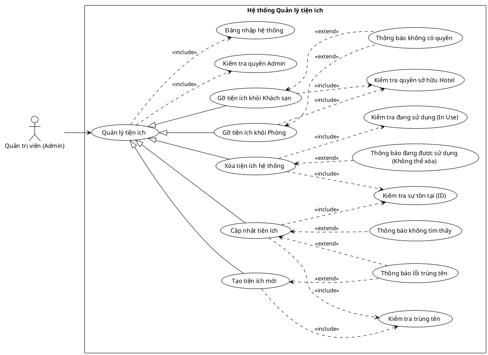

<!-- Mảnh Level-3 được tạo từ mục 3.2. Theo MEGA-DOCUMENT PROTOCOL, chỉnh sửa mặc định phải thực hiện tại mảnh này. Không tự ý chỉnh sửa PlantUML/code fence nếu tác vụ không yêu cầu. -->

#### 3.2.1.12 Usecase quản lý tiện ích

> Hình 3.12: Usecase quản lý tiện ích

Đặc tả Usecase tạo tiện ích mới

| Mục | Nội dung |
| --- | --- |
| Tên Use case | Tạo tiện ích mới |
| Actor | Quản trị viên (Admin) |
| Mô tả | Admin thêm một loại tiện ích dịch vụ mới vào hệ thống danh mục chung (ví dụ: "Wifi miễn phí", "Hồ bơi", "Gym") để sau này có thể gán cho các khách sạn hoặc phòng cụ thể. |
| Pre-conditions | - Actor đã đăng nhập và có quyền Admin. - Actor đang ở giao diện quản lý danh sách tiện ích. |
| Post-conditions | Success: Tiện ích mới được tạo và lưu vào cơ sở dữ liệu. Fail: Hệ thống báo lỗi nếu tên tiện ích đã tồn tại. |
| Luồng sự kiện chính | 1. Actor nhấn nút "Thêm tiện ích mới". 2. Actor nhập thông tin tiện ích (Tên, Mô tả, Icon/Hình ảnh). 3. Actor nhấn nút "Lưu". 4. Hệ thống thực hiện kiểm tra quyền Admin. 5. Hệ thống thực hiện kiểm tra trùng tên. 6. Nếu hợp lệ, hệ thống lưu tiện ích mới vào cơ sở dữ liệu. 7. Hệ thống hiển thị thông báo "Thêm tiện ích thành công". |
| Luồng sự kiện phụ | - Nếu tên tiện ích nhập vào đã có trong hệ thống: Hệ thống thực hiện thông báo lỗi trùng tên. |
| <Include Use Case> Quy trình Nghiệp vụ | - Kiểm tra quyền Admin: (Kế thừa từ Parent) Hệ thống xác thực quyền hạn trước khi cho phép thực hiện hành động ghi dữ liệu. - Kiểm tra trùng tên: Hệ thống đối chiếu tên tiện ích mới với danh sách hiện có trong DB để đảm bảo tính duy nhất. |
| <Extend Use Case> Thông báo lỗi trùng tên | Điều kiện: Khi quy trình kiểm tra tên phát hiện sự trùng lặp. Hành động: - Hệ thống hiển thị cảnh báo: "Tên tiện ích này đã tồn tại trong hệ thống". - Hệ thống yêu cầu nhập tên khác. |
| <Extend Use Case>  Thông báo thiếu ảnh | Điều kiện: Khi người dùng cố gắng lưu mà chưa có URL hình ảnh hợp lệ. Hành động: - Hệ thống hiển thị lỗi: "Vui lòng tải lên ít nhất một hình ảnh cho khách sạn". |

Đặc tả Usecase cập nhật tiện ích

| Mục | Nội dung |
| --- | --- |
| Tên Use case | Cập nhật tiện ích |
| Actor | Quản trị viên (Admin) |
| Mô tả | Admin thay đổi thông tin chi tiết của một tiện ích đã có trong hệ thống (như tên, mô tả, hình ảnh) để sửa lỗi hoặc làm mới nội dung. |
| Pre-conditions | - Actor đã đăng nhập và có quyền Admin. - Tiện ích cần cập nhật phải đang tồn tại trong hệ thống. |
| Post-conditions | Success: Thông tin tiện ích được cập nhật mới vào cơ sở dữ liệu. Fail: Hệ thống giữ nguyên thông tin cũ và báo lỗi (nếu trùng tên hoặc không tìm thấy). |
| Luồng sự kiện chính | 1. Actor chọn chức năng "Chỉnh sửa" tại dòng tiện ích cần cập nhật. 2. Actor thay đổi các thông tin mong muốn (Tên, hình ảnh...). 3. Actor nhấn nút "Lưu thay đổi". 4. Hệ thống thực hiện kiểm tra sự tồn tại (ID). 5. Hệ thống thực hiện kiểm tra trùng tên. 6. Nếu hợp lệ, hệ thống lưu thông tin mới. 7. Hệ thống hiển thị thông báo "Cập nhật tiện ích thành công". |
| Luồng sự kiện phụ | - Nếu ID tiện ích không còn tồn tại trong DB (do đã bị xóa): Hệ thống thực hiện thông báo không tìm thấy. - Nếu tên mới bị trùng với một tiện ích khác: Hệ thống thực hiện thông báo lỗi trùng tên. |
| <Include Use Case> Quy trình Nghiệp vụ | - Kiểm tra sự tồn tại (ID): Hệ thống truy vấn DB để đảm bảo tiện ích đang thao tác vẫn còn hợp lệ. - Kiểm tra trùng tên: Hệ thống so sánh tên mới nhập vào với các tiện ích khác (trừ chính nó) để tránh trùng lặp. |
| <Extend Use Case> Thông báo không tìm thấy | Điều kiện: Khi quy trình kiểm tra sự tồn tại trả về kết quả rỗng. Hành động: - Hệ thống hiển thị lỗi: "Tiện ích này không tồn tại hoặc đã bị xóa". - Hệ thống quay lại danh sách. |
| <Extend Use Case> Thông báo lỗi trùng tên | Điều kiện: Khi quy trình kiểm tra tên phát hiện sự trùng lặp. Hành động: - Hệ thống hiển thị cảnh báo: "Tên tiện ích đã được sử dụng". |

Đặc tả Usecase xóa tiện ích hệ thống

| Mục | Nội dung |
| --- | --- |
| Tên Use case | Xóa tiện ích hệ thống |
| Actor | Quản trị viên (Admin) |
| Mô tả | Admin thực hiện xóa một loại tiện ích khỏi danh mục chung của hệ thống. Để bảo vệ dữ liệu, hệ thống chỉ cho phép xóa nếu tiện ích này chưa được gán cho bất kỳ khách sạn hay phòng nào. |
| Pre-conditions | - Actor đã đăng nhập và có quyền Admin. - Tiện ích cần xóa đang tồn tại. |
| Post-conditions | Success: Tiện ích bị xóa vĩnh viễn khỏi danh mục hệ thống. Fail: Hệ thống giữ nguyên dữ liệu và báo lỗi (nếu đang được sử dụng). |
| Luồng sự kiện chính | 1. Actor nhấn nút "Xóa" tại dòng tiện ích mong muốn. 2. Hệ thống hiển thị hộp thoại xác nhận xóa. 3. Actor nhấn nút "Đồng ý". 4. Hệ thống thực hiện kiểm tra sự tồn tại (ID). 5. Hệ thống thực hiện kiểm tra đang sử dụng (In Use). 6. Nếu không có ai đang sử dụng, hệ thống xóa tiện ích khỏi DB. 7. Hệ thống hiển thị thông báo "Đã xóa tiện ích thành công". |
| Luồng sự kiện phụ | - Nếu tiện ích đang được liên kết với ít nhất một khách sạn hoặc phòng: Hệ thống thực hiện thông báo đang được sử dụng. - Nếu tiện ích không tìm thấy: Hệ thống thực hiện thông báo không tìm thấy. |
| <Include Use Case> Quy trình Nghiệp vụ | - Kiểm tra sự tồn tại (ID): Xác minh ID tiện ích hợp lệ trong DB. - Kiểm tra đang sử dụng (In Use): Hệ thống quét các bảng liên kết (HotelAmenities, RoomAmenities) để đếm số lượng tham chiếu đến tiện ích này. Nếu count > 0, tiện ích được coi là "Đang sử dụng". |
| <Extend Use Case> Thông báo đang được sử dụng | Điều kiện: Khi quy trình kiểm tra "In Use" phát hiện tiện ích đang có ràng buộc dữ liệu. Hành động: - Hệ thống hiển thị cảnh báo: "Không thể xóa tiện ích này vì đang được sử dụng bởi các khách sạn/phòng". - Hệ thống hủy bỏ lệnh xóa. |
| <Extend Use Case> Thông báo lỗi trùng tên | Điều kiện: Khi quy trình kiểm tra tên phát hiện sự trùng lặp. Hành động: - Hệ thống hiển thị cảnh báo: "Tên tiện ích đã được sử dụng". |

Đặc tả Usecase gỡ tiện ích khỏi Khách sạn

| Mục | Nội dung |
| --- | --- |
| Tên Use case | Gỡ tiện ích khỏi Khách sạn |
| Actor | Quản trị viên (Admin) |
| Mô tả | Admin loại bỏ một tiện ích cụ thể khỏi danh sách tiện ích của một khách sạn. Hành động này chỉ ngắt liên kết giữa khách sạn và tiện ích, không xóa tiện ích khỏi hệ thống. |
| Pre-conditions | - Actor đã đăng nhập và có quyền Admin. - Tiện ích đang được gán cho khách sạn đó. |
| Post-conditions | Success: Liên kết giữa tiện ích và khách sạn bị xóa. Fail: Hệ thống giữ nguyên liên kết và báo lỗi (nếu không có quyền). |
| Luồng sự kiện chính | 1. Actor truy cập vào trang quản lý tiện ích của một khách sạn cụ thể. 2. Actor nhấn nút "Gỡ bỏ" tại dòng tiện ích muốn xóa. 3. Hệ thống hiển thị hộp thoại xác nhận. 4. Actor nhấn nút "Đồng ý". 5. Hệ thống thực hiện kiểm tra quyền sở hữu Hotel. 6. Nếu hợp lệ, hệ thống xóa liên kết tiện ích khỏi khách sạn. 7. Hệ thống hiển thị thông báo "Đã gỡ tiện ích khỏi khách sạn thành công". |
| Luồng sự kiện phụ | - Nếu Actor không phải là chủ sở hữu của khách sạn này: Hệ thống thực hiện thông báo không có quyền. |
| <Include Use Case> Quy trình Nghiệp vụ | - Kiểm tra quyền sở hữu Hotel: Hệ thống xác minh Admin hiện tại có quyền quản lý đối với khách sạn đang thao tác hay không (Owner Check). |
| <Extend Use Case> Thông báo không có quyền | Điều kiện: Khi quy trình kiểm tra quyền sở hữu trả về kết quả False. Hành động: - Hệ thống hiển thị cảnh báo: "Bạn không có quyền thay đổi tiện ích của khách sạn này". - Hệ thống hủy bỏ thao tác. |
| <Extend Use Case> Thông báo lỗi trùng tên | Điều kiện: Khi quy trình kiểm tra tên phát hiện sự trùng lặp. Hành động: - Hệ thống hiển thị cảnh báo: "Tên tiện ích đã được sử dụng". |

Đặc tả Usecase gỡ tiện ích khỏi Phòng

| Mục | Nội dung |
| --- | --- |
| Tên Use case | Gỡ tiện ích khỏi Phòng |
| Actor | Quản trị viên (Admin) |
| Mô tả | Admin loại bỏ một tiện ích cụ thể khỏi danh sách tiện ích của một phòng nghỉ. Hành động này chỉ ngắt liên kết giữa phòng và tiện ích, không xóa tiện ích khỏi hệ thống. |
| Pre-conditions | - Actor đã đăng nhập và có quyền Admin. - Tiện ích đang được gán cho phòng đó. |
| Post-conditions | Success: Liên kết giữa tiện ích và phòng bị xóa khỏi cơ sở dữ liệu. Fail: Hệ thống giữ nguyên liên kết và báo lỗi (nếu không có quyền). |
| Luồng sự kiện chính | 1. Actor truy cập vào trang cấu hình tiện ích của một phòng cụ thể. 2. Actor nhấn nút "Gỡ bỏ" tại dòng tiện ích muốn xóa. 3. Hệ thống hiển thị hộp thoại xác nhận. 4. Actor nhấn nút "Đồng ý". 5. Hệ thống thực hiện kiểm tra quyền sở hữu Phòng. 6. Nếu hợp lệ, hệ thống xóa liên kết tiện ích khỏi phòng. 7. Hệ thống hiển thị thông báo "Đã gỡ tiện ích khỏi phòng thành công". |
| Luồng sự kiện phụ | - Nếu Actor không phải là chủ sở hữu của khách sạn chứa phòng này: Hệ thống thực hiện thông báo không có quyền. |
| <Include Use Case> Quy trình Nghiệp vụ | - Kiểm tra quyền sở hữu Phòng: Hệ thống truy xuất khách sạn chứa phòng này, sau đó xác minh Admin hiện tại có phải là chủ sở hữu (Owner) của khách sạn đó hay không. |
| <Extend Use Case> Thông báo không có quyền | Điều kiện: Khi quy trình kiểm tra quyền sở hữu trả về kết quả False. Hành động: - Hệ thống hiển thị cảnh báo: "Bạn không có quyền thay đổi tiện ích của phòng này". - Hệ thống hủy bỏ thao tác. |
| <Extend Use Case> Thông báo lỗi trùng tên | Điều kiện: Khi quy trình kiểm tra tên phát hiện sự trùng lặp. Hành động: - Hệ thống hiển thị cảnh báo: "Tên tiện ích đã được sử dụng". |
