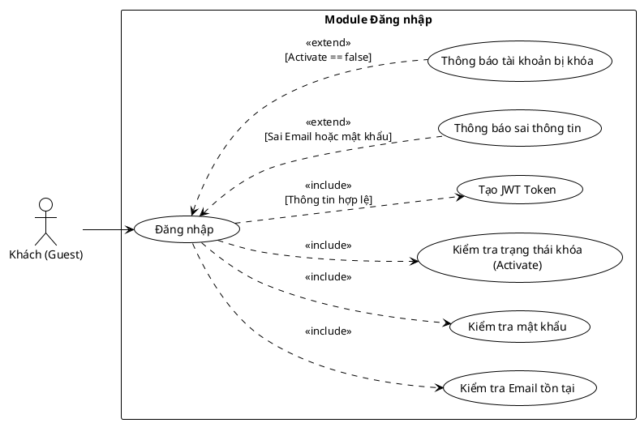

<ai_context>
File này là mảnh Level-3 thuộc mục 3.2. Chứa Đặc tả Use case cho chức năng Đăng nhập.
</ai_context>

<system_instruction>
TUYỆT ĐỐI KHÔNG tự ý thay đổi, xóa, định dạng lại mã nguồn PlantUML hoặc code fence trừ khi tác vụ yêu cầu đích danh việc sửa sơ đồ.
</system_instruction>

#### 3.2.1.1 Usecase đăng nhập

> Hình 3.1: Usecase đăng nhập

Đặc tả Usecase đăng nhập

| Mục | Nội dung |
| --- | --- |
| Tên Use case | Đăng nhập |
| Actor | Khách (Guest) |
| Mô tả | Người dùng sử dụng Email và Mật khẩu để xác thực danh tính và truy cập vào hệ thống. Hệ thống sẽ cấp phát JWT Token nếu xác thực thành công. |
| Pre-conditions | Actor truy cập vào trang đăng nhập và chưa thực hiện đăng nhập. |
| Post-conditions | Success: Hệ thống trả về JWT Token, chuyển hướng người dùng vào trang chủ/trang quản trị. Fail: Hệ thống hiển thị thông báo lỗi tương ứng. |
| Luồng sự kiện chính | 1. Actor nhập Email và Mật khẩu. 2. Actor nhấn nút "Đăng nhập". 3. Hệ thống thực hiện kiểm tra Email tồn tại. 4. Hệ thống thực hiện kiểm tra mật khẩu chính xác. 5. Hệ thống thực hiện kiểm tra trạng thái khóa của tài khoản. 6. Nếu tất cả thông tin hợp lệ, hệ thống thực hiện tạo JWT Token. 7. Hệ thống hiển thị thông báo thành công và chuyển hướng Actor. |
| Luồng sự kiện phụ | - Nếu Email không tồn tại hoặc sai Mật khẩu: Hệ thống thực hiện thông báo sai thông tin. - Nếu tài khoản chưa kích hoạt (Activate == false): Hệ thống thực hiện thông báo tài khoản bị khóa. |
| <Include Use Case> Quy trình Kiểm tra & Xác thực | - Kiểm tra Email: Hệ thống truy vấn cơ sở dữ liệu để xác nhận email có tồn tại. - Kiểm tra Mật khẩu: Hệ thống so sánh mật khẩu nhập vào (đã hash) với mật khẩu trong cơ sở dữ liệu. - Kiểm tra Trạng thái: Hệ thống xem xét trạng thái is_active của tài khoản. - Tạo Token: Hệ thống sinh chuỗi JWT chứa thông tin người dùng để xác thực các phiên làm việc sau. |
| <Extend Use Case> Thông báo sai thông tin | Điều kiện: Khi quy trình kiểm tra Email hoặc Mật khẩu thất bại. Hành động: - Hệ thống hiển thị thông báo lỗi: "Tên đăng nhập hoặc mật khẩu không đúng". - Hệ thống xóa trường mật khẩu để người dùng nhập lại. |
