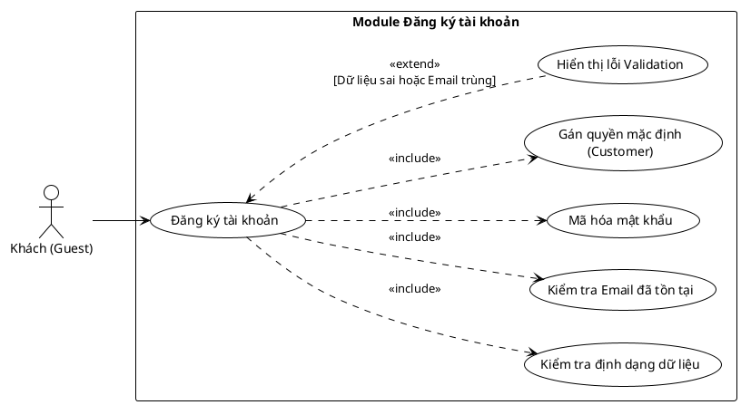

<!-- Mảnh Level-3 được tạo từ mục 3.2. Theo MEGA-DOCUMENT PROTOCOL, chỉnh sửa mặc định phải thực hiện tại mảnh này. Không tự ý chỉnh sửa PlantUML/code fence nếu tác vụ không yêu cầu. -->

#### 3.2.1.2 Usecase đăng ký

> Hình 3.2: Usecase đăng ký

Đặc tả Usecase đăng ký

| Mục                                           | Nội dung                                                                                                                                                                                                                                                                                                                                                                      |
| --------------------------------------------- | ----------------------------------------------------------------------------------------------------------------------------------------------------------------------------------------------------------------------------------------------------------------------------------------------------------------------------------------------------------------------------- |
| Tên Use case                                  | Đăng ký tài khoản                                                                                                                                                                                                                                                                                                                                                             |
| Actor                                         | Khách (Guest)                                                                                                                                                                                                                                                                                                                                                                 |
| Mô tả                                         | Người dùng (Khách) cung cấp thông tin cá nhân để tạo tài khoản mới trên hệ thống. Tài khoản sau khi tạo sẽ có quyền mặc định là Customer.                                                                                                                                                                                                                                     |
| Pre-conditions                                | Actor đang ở trang đăng ký và chưa đăng nhập vào hệ thống.                                                                                                                                                                                                                                                                                                                    |
| Post-conditions                               | Success: Tài khoản mới được tạo trong cơ sở dữ liệu với mật khẩu đã mã hóa và quyền hạn chính xác. Fail: Hệ thống hiển thị thông báo lỗi cụ thể (do định dạng sai hoặc email đã tồn tại).                                                                                                                                                                                  |
| Luồng sự kiện chính                           | 1. Actor nhập các thông tin đăng ký (Email, Mật khẩu, Họ tên, v.v.). 2. Actor nhấn nút "Đăng ký". 3. Hệ thống thực hiện kiểm tra định dạng dữ liệu. 4. Hệ thống thực hiện kiểm tra Email đã tồn tại. 5. Hệ thống thực hiện mã hóa mật khẩu. 6. Hệ thống thực hiện gán quyền mặc định (Customer). 7. Hệ thống lưu thông tin và thông báo đăng ký thành công. |
| Luồng sự kiện phụ                             | - Nếu dữ liệu nhập vào sai định dạng hoặc Email đã được sử dụng: Hệ thống thực hiện hiển thị lỗi Validation.                                                                                                                                                                                                                                                                  |
| <Include Use Case> Quy trình Xử lý dữ liệu | - Kiểm tra định dạng: Hệ thống xác thực tính hợp lệ của email, độ mạnh mật khẩu, và các trường bắt buộc. - Kiểm tra Email: Hệ thống truy vấn xem email đã có trong hệ thống chưa. - Mã hóa mật khẩu: Hệ thống chuyển đổi mật khẩu thô sang chuỗi mã hóa (hash) để bảo mật. - Gán quyền: Hệ thống mặc định thiết lập vai trò (Role) cho tài khoản mới là "Customer".  |
| <Extend Use Case> Hiển thị lỗi Validation  | Điều kiện: Khi quy trình kiểm tra định dạng thất bại hoặc quy trình kiểm tra Email phát hiện trùng lặp. Hành động: - Hệ thống hiển thị thông báo chi tiết lỗi (ví dụ: "Email không hợp lệ", "Email đã tồn tại", "Mật khẩu quá ngắn"). - Hệ thống yêu cầu người dùng nhập lại các thông tin chưa hợp lệ.                                                              |
