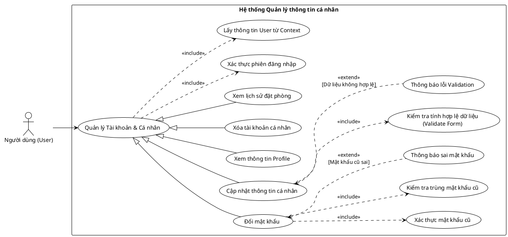

<!-- Mảnh Level-3 được tạo từ mục 3.2. Theo MEGA-DOCUMENT PROTOCOL, chỉnh sửa mặc định phải thực hiện tại mảnh này. Không tự ý chỉnh sửa PlantUML/code fence nếu tác vụ không yêu cầu. -->

#### 3.2.1.3 Usecase quản lý thông tin cá nhân

> Hình 3.3: Usecase quản lý thông tin cá nhân

Đặc tả Usecase cập nhật thông tin cá nhân

| Mục | Nội dung |
| --- | --- |
| Tên Use case | Cập nhật thông tin cá nhân |
| Actor | Người dùng (User) |
| Mô tả | Người dùng thay đổi các thông tin cá nhân (như họ tên, số điện thoại, địa chỉ...) để cập nhật hồ sơ của mình trên hệ thống. |
| Pre-conditions | - Actor đã đăng nhập thành công vào hệ thống. - Hệ thống đã lấy được thông tin User hiện tại (Context). |
| Post-conditions | Success: Thông tin mới được cập nhật vào cơ sở dữ liệu. Fail: Hệ thống hiển thị thông báo lỗi validation và giữ nguyên dữ liệu cũ. |
| Luồng sự kiện chính | 1. Actor chọn chức năng "Cập nhật thông tin" trên giao diện profile. 2. Actor chỉnh sửa các trường thông tin mong muốn. 3. Actor nhấn nút "Lưu thay đổi". 4. Hệ thống thực hiện kiểm tra tính hợp lệ dữ liệu (Validate Form). 5. Nếu dữ liệu hợp lệ, hệ thống lưu thông tin mới vào cơ sở dữ liệu. 6. Hệ thống hiển thị thông báo "Cập nhật thành công". |
| Luồng sự kiện phụ | - Nếu dữ liệu nhập vào không đúng định dạng (ví dụ: SĐT sai, ngày sinh không hợp lệ): Hệ thống thực hiện thông báo lỗi Validation. |
| <Include Use Case> Quy trình Nghiệp vụ | - Lấy Context: Hệ thống xác định chính xác User đang thao tác dựa trên phiên đăng nhập. - Kiểm tra tính hợp lệ: Hệ thống xét duyệt các quy tắc nghiệp vụ (độ dài chuỗi, định dạng số, các trường bắt buộc) đối với dữ liệu người dùng vừa nhập. |
| <Extend Use Case> Thông báo lỗi Validation | Điều kiện: Khi quy trình kiểm tra tính hợp lệ phát hiện dữ liệu sai quy chuẩn. Hành động: - Hệ thống hiển thị thông báo lỗi cụ thể ngay tại trường dữ liệu không hợp lệ. - Hệ thống yêu cầu người dùng nhập lại. |

Đặc tả Usecase đổi mật khẩu

| Mục | Nội dung |
| --- | --- |
| Tên Use case | Đổi mật khẩu |
| Actor | Người dùng (User) |
| Mô tả | Người dùng thay đổi mật khẩu đăng nhập hiện tại sang một mật khẩu mới để bảo mật tài khoản. |
| Pre-conditions | - Actor đã đăng nhập thành công. - Actor nhớ mật khẩu hiện tại. |
| Post-conditions | Success: Mật khẩu mới được mã hóa và cập nhật. Các phiên đăng nhập cũ có thể bị vô hiệu hóa (tùy chính sách). Fail: Mật khẩu không đổi, hệ thống báo lỗi sai mật khẩu cũ hoặc mật khẩu mới trùng lặp. |
| Luồng sự kiện chính | 1. Actor chọn chức năng "Đổi mật khẩu". 2. Actor nhập Mật khẩu cũ, Mật khẩu mới, và Xác nhận mật khẩu mới. 3. Actor nhấn nút "Đổi mật khẩu". 4. Hệ thống thực hiện xác thực mật khẩu cũ. 5. Hệ thống thực hiện kiểm tra trùng mật khẩu cũ (đảm bảo pass mới khác pass cũ). 6. Nếu hợp lệ, hệ thống thực hiện mã hóa và cập nhật mật khẩu mới. 7. Hệ thống hiển thị thông báo thành công. |
| Luồng sự kiện phụ | - Nếu Mật khẩu cũ không khớp với dữ liệu trong DB: Hệ thống thực hiện thông báo sai mật khẩu. - Nếu Mật khẩu mới giống hệt Mật khẩu cũ: Hệ thống hiển thị cảnh báo mật khẩu mới phải khác mật khẩu cũ. |
| <Include Use Case> Quy trình Kiểm tra bảo mật | - Xác thực mật khẩu cũ: Hệ thống so sánh chuỗi hash của mật khẩu nhập vào với mật khẩu đang lưu trong DB. - Kiểm tra trùng: Hệ thống đảm bảo tính bảo mật bằng cách ngăn người dùng sử dụng lại mật khẩu vừa dùng. |
| <Extend Use Case> Thông báo sai mật khẩu | Điều kiện: Khi bước xác thực mật khẩu cũ thất bại. Hành động: - Hệ thống hiển thị thông báo: "Mật khẩu hiện tại không đúng". - Hệ thống xóa các trường mật khẩu để nhập lại. |

Đặc tả Usecase xem thông tin profile

| Mục | Nội dung |
| --- | --- |
| Tên Use case | Xem thông tin Profile |
| Actor | Người dùng (User) |
| Mô tả | Người dùng truy cập vào trang cá nhân để xem các thông tin chi tiết về tài khoản của mình đang được lưu trữ trong hệ thống. |
| Pre-conditions | - Actor đã đăng nhập thành công - Hệ thống đã xác định được ngữ cảnh (Context) của người dùng. |
| Post-conditions | Success: Hệ thống hiển thị đầy đủ thông tin cá nhân (Họ tên, Email, SĐT, Avatar...). Fail: Hệ thống yêu cầu đăng nhập lại nếu phiên làm việc hết hạn. |
| Luồng sự kiện chính | 1. Actor chọn menu "Hồ sơ cá nhân". 2. Hệ thống thực hiện lấy thông tin User từ Context. 3. Hệ thống truy xuất dữ liệu chi tiết từ cơ sở dữ liệu. 4. Hệ thống hiển thị giao diện thông tin profile. |
| Luồng sự kiện phụ | - Nếu không lấy được thông tin User (Lỗi phiên): Hệ thống thực hiện chuyển hướng về trang đăng nhập. |
| <Include Use Case> Quy trình Nghiệp vụ | - Lấy thông tin User từ Context: Hệ thống xác định ID người dùng hiện tại từ Token hoặc Session để đảm bảo hiển thị đúng dữ liệu của người đó. |
| <Extend Use Case> Thông báo không thể hủy | Điều kiện: Khi đơn hàng đang ở trạng thái Checked-out hoặc Cancelled. Hành động: - Hệ thống hiển thị lỗi: "Đơn hàng này không thể hủy vì đã hoàn tất hoặc đã bị hủy". |
| <Extend Use Case> Thông báo không có quyền | Điều kiện: Khi quy trình kiểm tra quyền sở hữu thất bại. Hành động: - Hệ thống hiển thị cảnh báo bảo mật: "Bạn không có quyền thao tác trên đơn hàng này". |

Đặc tả Usecase xóa tài khoản cá nhân

| Mục | Nội dung |
| --- | --- |
| Tên Use case | Xóa tài khoản cá nhân |
| Actor | Người dùng (User) |
| Mô tả | Người dùng yêu cầu xóa vĩnh viễn (hoặc vô hiệu hóa) tài khoản của mình khỏi hệ thống. |
| Pre-conditions | - Actor đã đăng nhập thành công. |
| Post-conditions | Success: Tài khoản bị xóa/vô hiệu hóa, người dùng bị đăng xuất ngay lập tức. Fail: Hệ thống báo lỗi nếu có ràng buộc dữ liệu (ví dụ: đang có đơn đặt phòng chưa hoàn tất). |
| Luồng sự kiện chính | 1. Actor chọn chức năng "Xóa tài khoản" trong phần cài đặt. 2. Hệ thống hiển thị cảnh báo và yêu cầu xác nhận.  3. Actor xác nhận xóa. 4. Hệ thống thực hiện lấy thông tin User từ Context. 5. Hệ thống thực hiện chuyển trạng thái tài khoản sang "Đã xóa" (Soft Delete) hoặc xóa khỏi DB. 6. Hệ thống thực hiện đăng xuất người dùng và chuyển về trang chủ. |
| Luồng sự kiện phụ | - Actor hủy bỏ xác nhận: Hệ thống quay lại màn hình cài đặt. |
| <Include Use Case> Quy trình Nghiệp vụ | - Lấy thông tin User từ Context: Xác định chính xác tài khoản cần xóa. |
| <Extend Use Case> Thông báo không thể hủy | Điều kiện: Khi đơn hàng đang ở trạng thái Checked-out hoặc Cancelled. Hành động: - Hệ thống hiển thị lỗi: "Đơn hàng này không thể hủy vì đã hoàn tất hoặc đã bị hủy". |
| <Extend Use Case> Thông báo không có quyền | Điều kiện: Khi quy trình kiểm tra quyền sở hữu thất bại. Hành động: - Hệ thống hiển thị cảnh báo bảo mật: "Bạn không có quyền thao tác trên đơn hàng này". |

Đặc tả Usecase xem lịch sử đặt phòng

| Mục | Nội dung |
| --- | --- |
| Tên Use case | Xem lịch sử đặt phòng |
| Actor | Người dùng (User) |
| Mô tả | Người dùng xem lại danh sách các đơn đặt phòng mình đã thực hiện trong quá khứ và trạng thái của chúng. |
| Pre-conditions | - Actor đã đăng nhập thành công. |
| Post-conditions | Success: Danh sách lịch sử đặt phòng được hiển thị, sắp xếp theo thời gian. Fail: Hệ thống báo lỗi kết nối hoặc danh sách trống. |
| Luồng sự kiện chính | 1. Actor chọn mục "Lịch sử đặt phòng". 2. Hệ thống thực hiện lấy thông tin User từ Context. 3. Hệ thống truy vấn danh sách Booking gắn với ID người dùng đó. 4. Hệ thống hiển thị danh sách các đơn hàng (Ngày đặt, Khách sạn, Trạng thái...). |
| Luồng sự kiện phụ | - Nếu người dùng chưa từng đặt phòng: Hệ thống hiển thị thông báo "Bạn chưa có lịch sử đặt phòng nào". |
| <Include Use Case> Quy trình Nghiệp vụ | - Lấy thông tin User từ Context: Hệ thống sử dụng ID người dùng để lọc đúng các đơn hàng thuộc về họ. |
| <Extend Use Case> Thông báo không thể hủy | Điều kiện: Khi đơn hàng đang ở trạng thái Checked-out hoặc Cancelled. Hành động: - Hệ thống hiển thị lỗi: "Đơn hàng này không thể hủy vì đã hoàn tất hoặc đã bị hủy". |
| <Extend Use Case> Thông báo không có quyền | Điều kiện: Khi quy trình kiểm tra quyền sở hữu thất bại. Hành động: - Hệ thống hiển thị cảnh báo bảo mật: "Bạn không có quyền thao tác trên đơn hàng này". |
