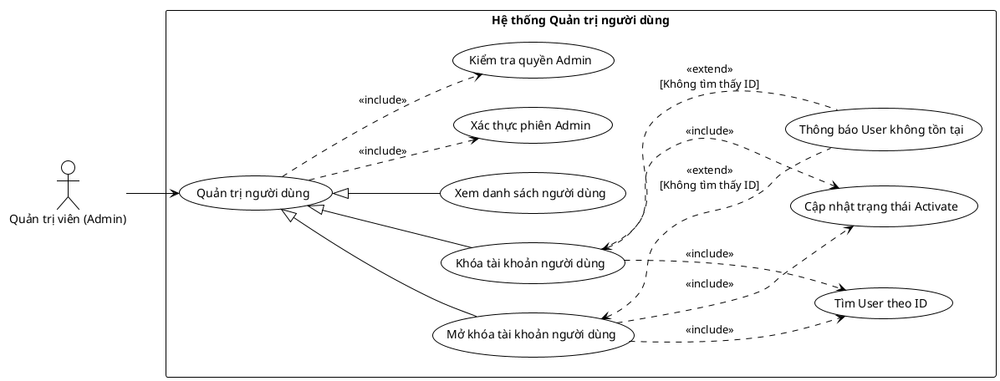

<!-- Mảnh Level-3 được tạo từ mục 3.2. Theo MEGA-DOCUMENT PROTOCOL, chỉnh sửa mặc định phải thực hiện tại mảnh này. Không tự ý chỉnh sửa PlantUML/code fence nếu tác vụ không yêu cầu. -->

#### 3.2.1.4 Usecase quản trị người dùng

> Hình 3.4: Usecase quản lý người dùng

Đặc tả Usecase xem danh sách người dùng

| Mục                                            | Nội dung                                                                                                                                                                                                              |
| ---------------------------------------------- | --------------------------------------------------------------------------------------------------------------------------------------------------------------------------------------------------------------------- |
| Tên Use case                                   | Xem danh sách người dùng                                                                                                                                                                                              |
| Actor                                          | Quản trị viên (Admin)                                                                                                                                                                                                 |
| Mô tả                                          | Admin xem toàn bộ danh sách tài khoản người dùng trong hệ thống để phục vụ công tác quản trị, giám sát và xử lý tài khoản.                                                                                            |
| Pre-conditions                                 | - Actor đã đăng nhập vào hệ thống. - Actor có quyền Admin.                                                                                                                                                         |
| Post-conditions                                | Success: Danh sách người dùng được hiển thị đầy đủ. Fail: Hệ thống từ chối truy cập nếu Actor không có quyền.                                                                                                      |
| Luồng sự kiện chính                            | 1. Actor truy cập mục "Quản lý người dùng". 2. Hệ thống thực hiện kiểm tra quyền Admin. 3. Nếu hợp lệ, hệ thống truy vấn danh sách User. 4. Hệ thống hiển thị danh sách người dùng kèm trạng thái tài khoản. |
| Luồng sự kiện phụ                              | - Nếu Actor không có quyền Admin: Hệ thống thực hiện thông báo không có quyền truy cập.                                                                                                                               |
| <Include Use Case> Quy trình Xác thực quyền | - Xác thực phiên Admin: Đảm bảo Actor đã xác thực phiên làm việc hợp lệ. - Kiểm tra quyền Admin: Xác minh Actor có vai trò Admin trước khi cho phép truy cập module quản trị.                                      |

Đặc tả Usecase khóa tài khoản người dùng

| Mục | Nội dung |
| --- | --- |
| Tên Use case | Khóa tài khoản người dùng |
| Actor | Quản trị viên (Admin) |
| Mô tả | Admin thực hiện khóa tài khoản của một người dùng cụ thể để ngăn họ đăng nhập vào hệ thống (ví dụ: do vi phạm chính sách). |
| Pre-conditions | - Actor đã đăng nhập và có quyền Admin.  - Tài khoản người dùng cần khóa đang ở trạng thái hoạt động (Active). |
| Post-conditions | Success: Trạng thái tài khoản chuyển sang "Locked" (hoặc Inactive). Fail: Hệ thống báo lỗi nếu người dùng không tồn tại. |
| Luồng sự kiện chính | 1. Actor tìm kiếm và chọn người dùng cần khóa từ danh sách. 2. Actor nhấn nút "Khóa tài khoản". 3. Hệ thống thực hiện tìm User theo ID. 4. Nếu tìm thấy, hệ thống thực hiện cập nhật trạng thái Activate thành False (Khóa). 5. Hệ thống hiển thị thông báo "Đã khóa tài khoản thành công". |
| Luồng sự kiện phụ | - Nếu ID người dùng không tồn tại: Hệ thống thực hiện thông báo User không tồn tại. |
| <Include Use Case> Quy trình Xử lý | - Tìm User theo ID: Xác định bản ghi người dùng trong CSDL. - Cập nhật trạng thái Activate: Thay đổi giá trị cờ trạng thái của người dùng. |
| <Extend Use Case> Thông báo User không tồn tại | Điều kiện: Khi không tìm thấy ID người dùng. Hành động: Hiển thị lỗi và hủy thao tác. |
| <Extend Use Case> Thông báo không có quyền | Điều kiện: Khi quy trình kiểm tra quyền sở hữu thất bại. Hành động: - Hệ thống hiển thị cảnh báo bảo mật: "Bạn không có quyền thao tác trên đơn hàng này". |

Đặc tả Usecase mở khóa tài khoản người dùng

| Mục | Nội dung |
| --- | --- |
| Tên Use case | Mở khóa tài khoản người dùng |
| Actor | Quản trị viên (Admin) |
| Mô tả | Admin khôi phục quyền truy cập cho một tài khoản người dùng đã bị khóa trước đó. |
| Pre-conditions | - Actor đã đăng nhập và có quyền Admin. - Tài khoản người dùng đang ở trạng thái bị khóa. |
| Post-conditions | Success: Trạng thái tài khoản chuyển sang "Active". Fail: Hệ thống báo lỗi nếu người dùng không tồn tại. |
| Luồng sự kiện chính | 1. Actor tìm kiếm và chọn người dùng bị khóa từ danh sách. 2. Actor nhấn nút "Mở khóa tài khoản". 3. Hệ thống thực hiện tìm User theo ID. 4. Nếu tìm thấy, hệ thống thực hiện cập nhật trạng thái Activate thành True (Hoạt động). 5. Hệ thống hiển thị thông báo "Đã mở khóa tài khoản thành công". |
| Luồng sự kiện phụ | - Nếu ID người dùng không tồn tại: Hệ thống thực hiện thông báo User không tồn tại. |
| <Include Use Case> Quy trình Xử lý | - Tìm User theo ID: Xác định bản ghi người dùng. - Cập nhật trạng thái Activate: Thay đổi giá trị cờ trạng thái của người dùng về hoạt động. |
| <Extend Use Case> Thông báo User không tồn tại | Điều kiện: Khi không tìm thấy ID người dùng. Hành động: Hiển thị lỗi và hủy thao tác. |
| <Extend Use Case> Thông báo không có quyền | Điều kiện: Khi quy trình kiểm tra quyền sở hữu thất bại. Hành động: - Hệ thống hiển thị cảnh báo bảo mật: "Bạn không có quyền thao tác trên đơn hàng này". |
