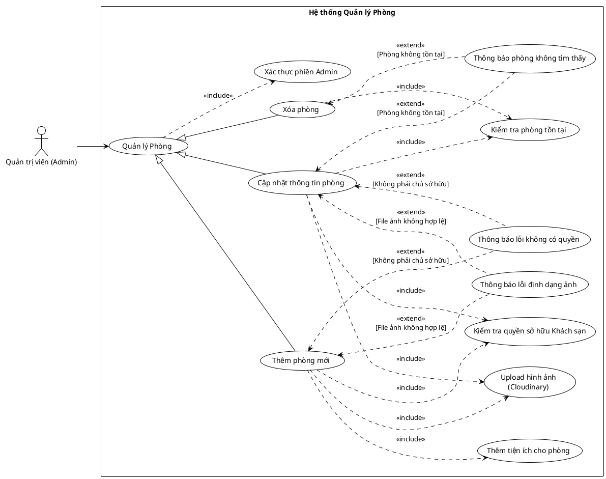

<!-- Mảnh Level-3 được tạo từ mục 3.2. Theo MEGA-DOCUMENT PROTOCOL, chỉnh sửa mặc định phải thực hiện tại mảnh này. Không tự ý chỉnh sửa PlantUML/code fence nếu tác vụ không yêu cầu. -->

#### 3.2.1.5 Usecase quản lý phòng

> Hình 3.5: Usecase quản lý phòng

Đặc tả Usecase thêm phòng mới

| Mục                                               | Nội dung                                                                                                                                                                                                                                                                                                                                                                                                                                                |
| ------------------------------------------------- | ------------------------------------------------------------------------------------------------------------------------------------------------------------------------------------------------------------------------------------------------------------------------------------------------------------------------------------------------------------------------------------------------------------------------------------------------------- |
| Tên Use case                                      | Thêm phòng mới                                                                                                                                                                                                                                                                                                                                                                                                                                          |
| Actor                                             | Quản trị viên (Admin)                                                                                                                                                                                                                                                                                                                                                                                                                                   |
| Mô tả                                             | Admin tạo và thêm một phòng mới vào khách sạn mà mình quản lý. Quá trình này bao gồm nhập thông tin chi tiết, tải lên hình ảnh và gán các tiện ích cho phòng.                                                                                                                                                                                                                                                                                           |
| Pre-conditions                                    | - Actor đã đăng nhập và có quyền Admin. - Actor phải là chủ sở hữu của khách sạn mà phòng sẽ được thêm vào.                                                                                                                                                                                                                                                                                                                                          |
| Post-conditions                                   | Success: Phòng mới được tạo và lưu vào cơ sở dữ liệu với đầy đủ thông tin, ảnh và tiện ích. Fail: Hệ thống báo lỗi và không tạo phòng (do lỗi quyền hoặc dữ liệu).                                                                                                                                                                                                                                                                                   |
| Luồng sự kiện chính                               | 1. Actor chọn chức năng "Thêm phòng mới" trong giao diện quản lý khách sạn.  2. Actor nhập các thông tin cơ bản (Tên phòng, Loại phòng, Giá, Mô tả...). 3. Actor thực hiện Upload hình ảnh. 4. Actor chọn danh sách tiện ích và thực hiện Thêm tiện ích cho phòng. 5. Actor nhấn nút "Lưu". 6. Hệ thống thực hiện Kiểm tra quyền sở hữu Khách sạn. 7. Nếu hợp lệ, hệ thống lưu dữ liệu phòng và thông báo "Thêm phòng thành công". |
| Luồng sự kiện phụ                                 | - Nếu Actor không phải là chủ sở hữu khách sạn: Hệ thống thực hiện Thông báo lỗi không có quyền. - Nếu file ảnh upload bị lỗi hoặc sai định dạng: Hệ thống thực hiện Thông báo lỗi định dạng ảnh.                                                                                                                                                                                                                                                    |
| <Include Use Case> Quy trình Nghiệp vụ         | - Kiểm tra quyền sở hữu Khách sạn: Hệ thống xác minh ID của người đang thực hiện có khớp với chủ sở hữu (Owner) của khách sạn hay không. - Upload hình ảnh: Hệ thống xử lý việc tải ảnh lên Cloudinary và lấy về URL. - Thêm tiện ích cho phòng: Hệ thống liên kết các tiện ích (Amenities) đã chọn vào bản ghi của phòng mới.                                                                                                                    |
| <Extend Use Case> Thông báo lỗi không có quyền | Điều kiện: Khi quy trình kiểm tra quyền sở hữu trả về False. Hành động: - Hệ thống hiển thị thông báo: "Bạn không có quyền thêm phòng vào khách sạn này". - Hệ thống chặn hành động lưu.                                                                                                                                                                                                                                                       |
| <Extend Use Case> Thông báo lỗi định dạng ảnh  | Điều kiện: Khi file tải lên không phải là ảnh hoặc kích thước quá lớn. Hành động: - Hệ thống hiển thị cảnh báo: "Định dạng ảnh không hợp lệ hoặc file quá lớn".                                                                                                                                                                                                                                                                                   |

Đặc tả Usecase cập nhật thông tin phòng

| Mục | Nội dung |
| --- | --- |
| Tên Use case | Cập nhật thông tin phòng |
| Actor | Quản trị viên (Admin) |
| Mô tả | Admin thay đổi các thông tin chi tiết của một phòng đã tồn tại trong hệ thống (như giá cả, mô tả, loại phòng hoặc hình ảnh) để đảm bảo dữ liệu luôn chính xác. |
| Pre-conditions | - Actor đã đăng nhập và có quyền Admin. - Phòng cần cập nhật phải đang tồn tại trong hệ thống. |
| Post-conditions | Success: Thông tin phòng được cập nhật mới trong cơ sở dữ liệu. Fail: Hệ thống giữ nguyên thông tin cũ và báo lỗi (nếu phòng không tồn tại hoặc lỗi dữ liệu). |
| Luồng sự kiện chính | 1. Actor chọn chức năng "Chỉnh sửa" tại một phòng cụ thể trong danh sách. 2. Actor thay đổi các thông tin cần thiết (Giá, Mô tả...). 3. (Tùy chọn) Actor tải lên hình ảnh mới thay thế ảnh cũ. 4. Actor nhấn nút "Lưu thay đổi". 5. Hệ thống thực hiện kiểm tra phòng tồn tại. 6. (Nếu có ảnh mới) Hệ thống thực hiện upload hình ảnh. 7. Hệ thống lưu thông tin mới và thông báo cập nhật thành công. |
| Luồng sự kiện phụ | - Nếu ID phòng không tìm thấy trong DB: Hệ thống thực hiện thông báo phòng không tìm thấy. - Nếu ảnh tải lên bị lỗi định dạng: Hệ thống thực hiện thông báo lỗi định dạng ảnh. |
| <Include Use Case> Quy trình Nghiệp vụ | - Kiểm tra phòng tồn tại: Hệ thống truy vấn cơ sở dữ liệu để đảm bảo ID phòng đang thao tác là hợp lệ trước khi cho phép sửa. - Upload hình ảnh: Nếu người dùng thay đổi ảnh, hệ thống thực hiện tải ảnh mới lên Cloud server và cập nhật lại đường dẫn ảnh. |
| <Extend Use Case> Thông báo phòng không tìm thấy | Điều kiện: Khi quy trình kiểm tra sự tồn tại của phòng trả về kết quả rỗng (có thể do phòng vừa bị xóa bởi người khác). Hành động: - Hệ thống hiển thị lỗi: "Phòng này không còn tồn tại". - Hệ thống đưa người dùng quay lại danh sách phòng. |
| <Extend Use Case> Thông báo lỗi định dạng ảnh | Điều kiện: Khi file ảnh mới tải lên không đúng định dạng cho phép. Hành động: - Hệ thống hiển thị cảnh báo và yêu cầu chọn file khác. |

Đặc tả Usecase xóa phòng

| Mục | Nội dung |
| --- | --- |
| Tên Use case | Xóa phòng |
| Actor | Quản trị viên (Admin) |
| Mô tả | Admin thực hiện xóa vĩnh viễn một phòng khỏi danh sách phòng của khách sạn. Hành động này thường yêu cầu xác nhận kỹ lưỡng để tránh mất dữ liệu. |
| Pre-conditions | - Actor đã đăng nhập và có quyền Admin. - Phòng cần xóa đang hiện hữu trong danh sách quản lý. |
| Post-conditions | Success: Dữ liệu phòng bị xóa khỏi cơ sở dữ liệu. Fail: Hệ thống giữ nguyên dữ liệu và báo lỗi (nếu phòng không tìm thấy). |
| Luồng sự kiện chính | 1. Actor nhấn nút "Xóa" tại dòng thông tin của phòng cần xóa. 2. Hệ thống hiển thị hộp thoại yêu cầu xác nhận hành động. 3. Actor nhấn nút "Đồng ý" (Confirm). 4. Hệ thống thực hiện kiểm tra phòng tồn tại. 5. Nếu phòng hợp lệ, hệ thống thực hiện xóa dữ liệu phòng. 6. Hệ thống hiển thị thông báo "Đã xóa phòng thành công" và cập nhật lại danh sách. |
| Luồng sự kiện phụ | - Nếu trong quá trình xử lý, phòng không còn tồn tại trong DB (ví dụ: đã bị xóa bởi admin khác): Hệ thống thực hiện thông báo phòng không tìm thấy. |
| <Include Use Case> Quy trình Nghiệp vụ | - Kiểm tra phòng tồn tại: Hệ thống truy vấn cơ sở dữ liệu theo ID của phòng để đảm bảo đối tượng cần xóa là hợp lệ trước khi thực thi lệnh xóa. |
| <Extend Use Case> Thông báo phòng không tìm thấy | Điều kiện: Khi quy trình kiểm tra trả về kết quả rằng ID phòng không tồn tại. Hành động: - Hệ thống hiển thị thông báo lỗi: "Phòng này không tồn tại hoặc đã bị xóa". - Hệ thống tự động làm mới danh sách phòng để phản ánh dữ liệu thực tế. |
| <Extend Use Case> Thông báo lỗi định dạng ảnh | Điều kiện: Khi file ảnh mới tải lên không đúng định dạng cho phép. Hành động: - Hệ thống hiển thị cảnh báo và yêu cầu chọn file khác. |
