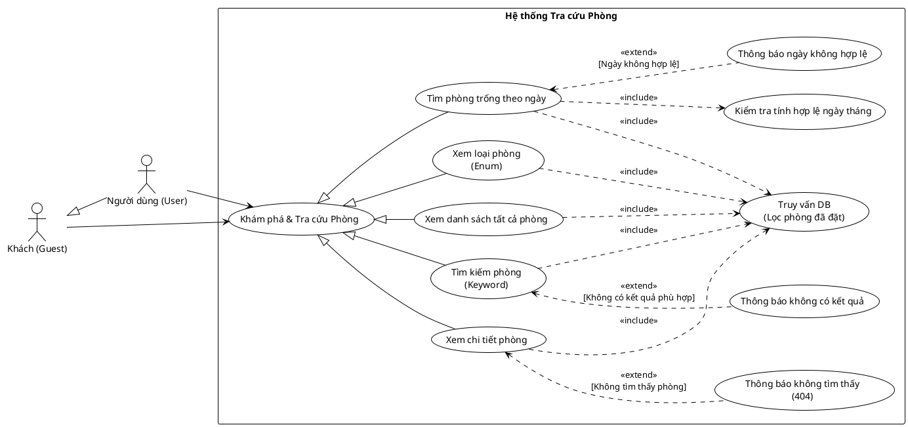

<!-- Mảnh Level-3 được tạo từ mục 3.2. Theo MEGA-DOCUMENT PROTOCOL, chỉnh sửa mặc định phải thực hiện tại mảnh này. Không tự ý chỉnh sửa PlantUML/code fence nếu tác vụ không yêu cầu. -->

#### 3.2.1.6 Usecase tra cứu phòng

> Hình 3.6: Usecase tra cứu phòng

Đặc tả Usecase xem danh sách tất cả phòng

| Mục                                                 | Nội dung                                                                                                                                                                                                                                               |
| --------------------------------------------------- | ------------------------------------------------------------------------------------------------------------------------------------------------------------------------------------------------------------------------------------------------------ |
| Tên Use case                                        | Xem danh sách tất cả phòng                                                                                                                                                                                                                             |
| Actor                                               | Khách (Guest), Người dùng (User)                                                                                                                                                                                                                       |
| Mô tả                                               | Người dùng truy cập vào trang danh sách để xem toàn bộ các phòng hiện có trong hệ thống mà không cần áp dụng bộ lọc tìm kiếm nào.                                                                                                                      |
| Pre-conditions                                      | Actor truy cập vào trang chủ hoặc trang danh sách phòng của hệ thống.                                                                                                                                                                                  |
| Post-conditions                                     | Success: Hệ thống hiển thị danh sách các phòng kèm thông tin tóm tắt (Hình ảnh, Tên, Giá...). Fail: Hệ thống thông báo lỗi kết nối hoặc danh sách trống.                                                                                            |
| Luồng sự kiện chính                                 | 1. Actor chọn menu "Phòng" hoặc "Danh sách phòng". 2. Hệ thống thực hiện truy vấn cơ sở dữ liệu để lấy danh sách phòng. 3. Hệ thống hiển thị danh sách phòng lên giao diện (có thể phân trang).                                                  |
| Luồng sự kiện phụ                                   | - Nếu hệ thống chưa có dữ liệu phòng nào: Hệ thống hiển thị thông báo "Chưa có phòng nào được cập nhật".                                                                                                                                               |
| <Include Use Case> Quy trình Nghiệp vụ           | Hệ thống lấy dữ liệu thô từ bảng Room để hiển thị.                                                                                                                                                                                                     |
| <Extend Use Case> Thông báo phòng không tìm thấy | Điều kiện: Khi quy trình kiểm tra trả về kết quả rằng ID phòng không tồn tại. Hành động: - Hệ thống hiển thị thông báo lỗi: "Phòng này không tồn tại hoặc đã bị xóa". - Hệ thống tự động làm mới danh sách phòng để phản ánh dữ liệu thực tế. |
| <Extend Use Case> Thông báo lỗi định dạng ảnh    | Điều kiện: Khi file ảnh mới tải lên không đúng định dạng cho phép. Hành động: - Hệ thống hiển thị cảnh báo và yêu cầu chọn file khác.                                                                                                            |

Đặc tả Usecase tìm phòng trống theo ngày

| Mục | Nội dung |
| --- | --- |
| Tên Use case | Tìm phòng trống theo ngày |
| Actor | Khách (Guest), Người dùng (User) |
| Mô tả | Người dùng nhập khoảng thời gian dự kiến lưu trú (Check-in, Check-out) để hệ thống lọc và hiển thị danh sách các phòng còn trống, chưa bị đặt trong khoảng thời gian đó. |
| Pre-conditions | Actor đang ở giao diện tìm kiếm phòng hoặc trang chủ. |
| Post-conditions | Success: Hệ thống hiển thị danh sách các phòng khả dụng trong khoảng ngày đã chọn. Fail: Hệ thống hiển thị thông báo lỗi ngày tháng hoặc thông báo không còn phòng trống. |
| Luồng sự kiện chính | 1. Actor chọn ngày Check-in và ngày Check-out trên bộ lọc. 2. Actor nhấn nút "Tìm kiếm" hoặc "Kiểm tra tình trạng". 3. Hệ thống thực hiện kiểm tra tính hợp lệ ngày tháng. 4. Hệ thống thực hiện truy vấn DB (lọc phòng đã đặt). 5. Hệ thống hiển thị danh sách phòng trống phù hợp. |
| Luồng sự kiện phụ | - Nếu ngày nhập vào không hợp lệ (ví dụ: Ngày về trước ngày đi, hoặc chọn ngày trong quá khứ): Hệ thống thực hiện thông báo ngày không hợp lệ. |
| <Include Use Case> Quy trình Nghiệp vụ | - Kiểm tra tính hợp lệ ngày tháng: Hệ thống xác thực logic thời gian (Check-out > Check-in >= Today). - Truy vấn DB: Hệ thống quét bảng Booking để loại trừ các ID phòng đã có lịch đặt trùng với khoảng thời gian khách chọn (Logic: NOT (ExistingCheckIn < NewCheckOut AND ExistingCheckOut > NewCheckIn)). |
| <Extend Use Case> Thông báo ngày không hợp lệ | Điều kiện: Khi quy trình kiểm tra ngày tháng phát hiện lỗi logic. Hành động: - Hệ thống hiển thị cảnh báo: "Ngày Check-in phải lớn hơn hiện tại và nhỏ hơn ngày Check-out". - Hệ thống yêu cầu nhập lại ngày. |
| <Extend Use Case> Thông báo lỗi định dạng ảnh | Điều kiện: Khi file ảnh mới tải lên không đúng định dạng cho phép. Hành động: - Hệ thống hiển thị cảnh báo và yêu cầu chọn file khác. |

Đặc tả Usecase xem chi tiết phòng

| Mục | Nội dung |
| --- | --- |
| Tên Use case | Xem chi tiết phòng |
| Actor | Khách (Guest), Người dùng (User) |
| Mô tả | Người dùng xem toàn bộ thông tin chi tiết của một phòng cụ thể, bao gồm hình ảnh chi tiết, danh sách tiện ích, mô tả đầy đủ và các đánh giá (nếu có). |
| Pre-conditions | Actor đang ở trang danh sách phòng hoặc trang kết quả tìm kiếm. |
| Post-conditions | Success: Hệ thống chuyển hướng sang trang chi tiết và hiển thị đầy đủ thông tin của phòng đó. Fail: Hệ thống hiển thị trang lỗi 404 hoặc thông báo không tìm thấy. |
| Luồng sự kiện chính | 1. Actor nhấn vào hình ảnh hoặc tên của một phòng bất kỳ trong danh sách. 2. Hệ thống thực hiện truy vấn DB theo ID phòng. 3. Nếu dữ liệu tồn tại, hệ thống tải thông tin chi tiết (Info, Images, Amenities). 4. Hệ thống hiển thị trang chi tiết phòng. |
| Luồng sự kiện phụ | - Nếu ID phòng trên URL không tồn tại trong cơ sở dữ liệu (do đường dẫn hỏng hoặc phòng đã bị xóa): Hệ thống thực hiện thông báo không tìm thấy (404). |
| <Include Use Case> Quy trình Nghiệp vụ | - Truy vấn DB: Hệ thống thực hiện câu lệnh tìm kiếm trong bảng Room (và các bảng liên kết như RoomImages, RoomAmenities) dựa trên ID được cung cấp. |
| <Extend Use Case> Thông báo không tìm thấy (404) | Điều kiện: Khi quy trình truy vấn DB trả về kết quả rỗng (Null). Hành động: - Hệ thống hiển thị trang lỗi: "Không tìm thấy phòng bạn yêu cầu". - Hệ thống cung cấp nút quay lại trang chủ hoặc danh sách phòng. |
| <Extend Use Case> Thông báo lỗi định dạng ảnh | Điều kiện: Khi file ảnh mới tải lên không đúng định dạng cho phép. Hành động: - Hệ thống hiển thị cảnh báo và yêu cầu chọn file khác. |

Đặc tả Usecase tìm kiếm phòng

| Mục | Nội dung |
| --- | --- |
| Tên Use case | Tìm kiếm phòng theo từ khóa |
| Actor | Khách (Guest), Người dùng (User) |
| Mô tả | Người dùng tìm kiếm các phòng cụ thể bằng cách nhập từ khóa (ví dụ: tên phòng, đặc điểm, view...). Hệ thống sẽ lọc và trả về các kết quả khớp với từ khóa đó. |
| Pre-conditions | Actor đang ở giao diện tìm kiếm hoặc trang danh sách phòng. |
| Post-conditions | Success: Hệ thống hiển thị danh sách các phòng có thông tin chứa từ khóa tìm kiếm. Fail: Hệ thống thông báo không tìm thấy kết quả phù hợp. |
| Luồng sự kiện chính | 1. Actor nhập từ khóa vào ô tìm kiếm (ví dụ: "Deluxe", "Sea View"). 2. Actor nhấn nút "Tìm kiếm". 3. Hệ thống thực hiện truy vấn cơ sở dữ liệu. 4. Hệ thống hiển thị danh sách kết quả tìm được. |
| Luồng sự kiện phụ | - Nếu không có phòng nào khớp với từ khóa: Hệ thống hiển thị thông báo "Không tìm thấy kết quả nào phù hợp với từ khóa của bạn". |
| <Include Use Case> Quy trình Nghiệp vụ | - Truy vấn cơ sở dữ liệu: Hệ thống thực hiện câu lệnh SELECT với điều kiện lọc LIKE %keyword% trên các trường Tên hoặc Mô tả của bảng Room. |
| <Extend Use Case> Thông báo lỗi định dạng ảnh | Điều kiện: Khi file ảnh mới tải lên không đúng định dạng cho phép. Hành động: - Hệ thống hiển thị cảnh báo và yêu cầu chọn file khác. |

Đặc tả Usecase xem loại phòng

| Mục | Nội dung |
| --- | --- |
| Tên Use case | Xem loại phòng |
| Actor | Khách (Guest), Người dùng (User) |
| Mô tả | Người dùng xem danh sách các hạng mục/loại phòng hiện có của khách sạn (ví dụ: Phòng đơn, Phòng đôi, VIP, Suite...) để hiểu rõ các phân khúc dịch vụ được cung cấp. |
| Pre-conditions | Actor truy cập vào trang chủ hoặc menu danh mục phòng. |
| Post-conditions | Success: Hệ thống hiển thị danh sách các loại phòng kèm mô tả đặc trưng. Fail: Hệ thống hiển thị danh sách trống (nếu chưa cấu hình) hoặc báo lỗi kết nối. |
| Luồng sự kiện chính | 1. Actor chọn menu "Loại phòng" hoặc bộ lọc theo hạng phòng. 2. Hệ thống thực hiện truy vấn dữ liệu loại phòng. 3. Hệ thống hiển thị danh sách các loại phòng lên giao diện. |
| Luồng sự kiện phụ | - Nếu hệ thống chưa có dữ liệu loại phòng nào: Hệ thống hiển thị thông báo "Chưa có dữ liệu loại phòng". |
| <Include Use Case> Quy trình Nghiệp vụ | - Truy vấn DB: Hệ thống lấy danh sách các giá trị Enum hoặc bảng danh mục loại phòng từ cơ sở dữ liệu để hiển thị cho người dùng. |
| <Extend Use Case> Thông báo lỗi định dạng ảnh | Điều kiện: Khi file ảnh mới tải lên không đúng định dạng cho phép. Hành động: - Hệ thống hiển thị cảnh báo và yêu cầu chọn file khác. |
