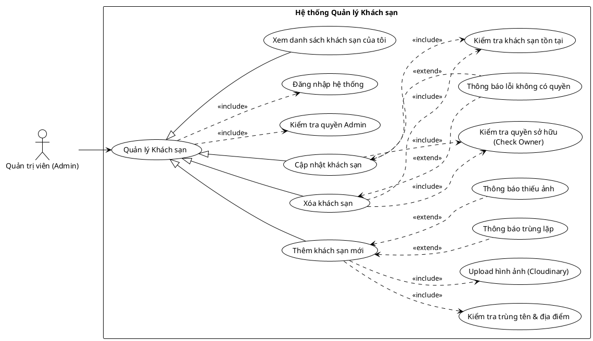

<!-- Mảnh Level-3 được tạo từ mục 3.2. Theo MEGA-DOCUMENT PROTOCOL, chỉnh sửa mặc định phải thực hiện tại mảnh này. Không tự ý chỉnh sửa PlantUML/code fence nếu tác vụ không yêu cầu. -->

#### 3.2.1.7 Usecase quản lý khách sạn

> Hình 3.7: Usecase quản lý khách sạn

Đặc tả Usecase thêm khách sạn mới

| Mục | Nội dung |
| --- | --- |
| Tên Use case | Thêm khách sạn mới |
| Actor | Quản trị viên (Admin) |
| Mô tả | Admin tạo và đăng ký một khách sạn mới vào hệ thống. Quá trình này bao gồm nhập thông tin định danh, địa chỉ và tải lên hình ảnh đại diện cho khách sạn. |
| Pre-conditions | - Actor đã đăng nhập vào hệ thống. - Actor có quyền Admin. |
| Post-conditions | Success: Khách sạn mới được lưu vào cơ sở dữ liệu và gán quyền sở hữu cho Admin tạo ra nó. Fail: Hệ thống báo lỗi trùng lặp hoặc lỗi dữ liệu (thiếu ảnh). |
| Luồng sự kiện chính | 1. Actor chọn chức năng "Thêm khách sạn". 2. Actor nhập thông tin (Tên, Địa chỉ, Thành phố, Mô tả...). 3. Actor thực hiện upload hình ảnh (Cloudinary). 4. Actor nhấn nút "Tạo mới". 5. Hệ thống thực hiện đăng nhập (kiểm tra session). 6. Hệ thống thực hiện kiểm tra quyền Admin. 7. Hệ thống thực hiện kiểm tra trùng tên & địa điểm. 8. Nếu hợp lệ, hệ thống lưu thông tin khách sạn mới. 9. Hệ thống hiển thị thông báo "Thêm khách sạn thành công". |
| Luồng sự kiện phụ | - Nếu tên hoặc địa chỉ khách sạn đã tồn tại: Hệ thống thực hiện thông báo trùng lặp. - Nếu người dùng không tải ảnh lên: Hệ thống thực hiện thông báo thiếu ảnh. |
| <Include Use Case> Quy trình Nghiệp vụ | - Kiểm tra quyền Admin: Hệ thống xác minh vai trò của tài khoản để đảm bảo chỉ quản trị viên mới được tạo khách sạn. - Upload hình ảnh: Hệ thống xử lý việc tải file ảnh lên server lưu trữ đám mây và trả về đường dẫn URL. - Kiểm tra trùng tên & địa điểm: Hệ thống so sánh thông tin nhập vào với dữ liệu hiện có để tránh việc tạo các bản ghi khách sạn trùng lặp (Duplicate). |
| <Extend Use Case> Thông báo trùng lặp | Điều kiện: Khi quy trình kiểm tra trùng lặp phát hiện dữ liệu tương tự đã tồn tại. Hành động: - Hệ thống hiển thị cảnh báo: "Khách sạn với tên và địa chỉ này đã tồn tại". - Hệ thống yêu cầu sửa lại thông tin. |
| <Extend Use Case> Thông báo thiếu ảnh | Điều kiện: Khi người dùng cố gắng lưu mà chưa có URL hình ảnh hợp lệ. Hành động: - Hệ thống hiển thị lỗi: "Vui lòng tải lên ít nhất một hình ảnh cho khách sạn". |

Đặc tả Usecase cập nhật khách sạn

| Mục | Nội dung |
| --- | --- |
| Tên Use case | Cập nhật khách sạn |
| Actor | Quản trị viên (Admin) |
| Mô tả | Admin thay đổi các thông tin chi tiết của một khách sạn đã tồn tại trong hệ thống (như tên, mô tả, tiện ích, hoặc ảnh đại diện) để cập nhật dữ liệu mới nhất. |
| Pre-conditions | - Actor đã đăng nhập và có quyền Admin. - Khách sạn cần cập nhật phải tồn tại. - Actor phải là người sở hữu (Owner) của khách sạn đó. |
| Post-conditions | Success: Thông tin khách sạn được cập nhật vào cơ sở dữ liệu. Fail: Hệ thống giữ nguyên thông tin cũ và báo lỗi (nếu không có quyền hoặc khách sạn không tồn tại). |
| Luồng sự kiện chính | 1. Actor chọn chức năng "Chỉnh sửa" tại khách sạn cần cập nhật. 2. Actor thay đổi các thông tin mong muốn (Tên, Mô tả, v.v.). 3. Actor nhấn nút "Lưu thay đổi". 4. Hệ thống thực hiện kiểm tra quyền sở hữu. 5. Hệ thống thực hiện kiểm tra khách sạn tồn tại. 6. Nếu hợp lệ, hệ thống lưu thông tin mới. 7. Hệ thống hiển thị thông báo "Cập nhật thành công". |
| Luồng sự kiện phụ | - Nếu Actor cố tình sửa khách sạn không thuộc quyền quản lý của mình: Hệ thống thực hiện thông báo lỗi không có quyền. |
| <Include Use Case> Quy trình Nghiệp vụ | - Kiểm tra quyền sở hữu: Hệ thống đối chiếu ID của Admin đang đăng nhập với ID chủ sở hữu (OwnerID) của khách sạn để đảm bảo tính bảo mật. - Kiểm tra khách sạn tồn tại: Hệ thống xác minh xem ID khách sạn có còn hợp lệ trong cơ sở dữ liệu hay không (tránh trường hợp vừa bị xóa). |
| <Extend Use Case> Thông báo lỗi không có quyền | Điều kiện: Khi quy trình kiểm tra quyền sở hữu trả về kết quả False (không khớp). Hành động: - Hệ thống hiển thị cảnh báo: "Bạn không có quyền chỉnh sửa khách sạn này".  - Hệ thống từ chối lưu thay đổi. |
| <Extend Use Case> Thông báo thiếu ảnh | Điều kiện: Khi người dùng cố gắng lưu mà chưa có URL hình ảnh hợp lệ. Hành động: - Hệ thống hiển thị lỗi: "Vui lòng tải lên ít nhất một hình ảnh cho khách sạn". |

Đặc tả Usecase xóa khách sạn

| Mục | Nội dung |
| --- | --- |
| Tên Use case | Xóa khách sạn |
| Actor | Quản trị viên (Admin) |
| Mô tả | Admin thực hiện xóa vĩnh viễn một khách sạn khỏi hệ thống. Hành động này yêu cầu quyền sở hữu đối với khách sạn đó và thường đi kèm bước xác nhận để tránh sai sót. |
| Pre-conditions | - Actor đã đăng nhập và có quyền Admin. - Khách sạn cần xóa đang tồn tại trong danh sách quản lý của Admin. |
| Post-conditions | Success: Dữ liệu khách sạn (và các phòng liên quan) bị xóa khỏi cơ sở dữ liệu. Fail: Hệ thống giữ nguyên dữ liệu và báo lỗi (nếu không có quyền hoặc khách sạn không tồn tại). |
| Luồng sự kiện chính | 1. Actor chọn nút "Xóa" tại khách sạn mong muốn trong danh sách. 2. Hệ thống hiển thị hộp thoại xác nhận. 3. Actor nhấn nút "Đồng ý" để xác nhận xóa. 4. Hệ thống thực hiện kiểm tra quyền sở hữu. 5. Hệ thống thực hiện kiểm tra khách sạn tồn tại. 6. Nếu hợp lệ, hệ thống xóa dữ liệu khách sạn. 7. Hệ thống hiển thị thông báo "Đã xóa khách sạn thành công". |
| Luồng sự kiện phụ | - Nếu Actor không phải là chủ sở hữu của khách sạn này: Hệ thống thực hiện thông báo lỗi không có quyền. |
| <Include Use Case> Quy trình Nghiệp vụ | - Kiểm tra quyền sở hữu: Hệ thống xác minh Admin hiện tại có phải là người tạo/sở hữu khách sạn này không (Owner Check). - Kiểm tra khách sạn tồn tại: Hệ thống đảm bảo ID khách sạn vẫn còn trong DB trước khi thực hiện lệnh xóa. |
| <Extend Use Case> Thông báo lỗi không có quyền | Điều kiện: Khi quy trình kiểm tra quyền sở hữu thất bại. Hành động: - Hệ thống hiển thị cảnh báo: "Bạn không có quyền xóa khách sạn này". - Hệ thống hủy bỏ thao tác xóa. |
| <Extend Use Case> Thông báo lỗi trùng tên | Điều kiện: Khi quy trình kiểm tra tên phát hiện sự trùng lặp. Hành động: - Hệ thống hiển thị cảnh báo: "Tên tiện ích đã được sử dụng". |

Đặc tả Usecase xem danh sách khách sạn của tôi

| Mục | Nội dung |
| --- | --- |
| Tên Use case | Xem danh sách khách sạn của tôi (View My Hotels) |
| Actor | Quản trị viên (Admin) |
| Mô tả | Admin xem danh sách toàn bộ các khách sạn mà mình đang sở hữu và quản lý. Tính năng này giúp Admin có cái nhìn tổng quan về tài sản của mình trên hệ thống. |
| Pre-conditions | - Actor đã đăng nhập vào hệ thống. - Actor có quyền Admin. |
| Post-conditions | Success: Hệ thống hiển thị danh sách các khách sạn do Admin này tạo/sở hữu. Fail: Hệ thống hiển thị danh sách trống (nếu chưa có khách sạn nào). |
| Luồng sự kiện chính | 1. Actor chọn menu "Khách sạn của tôi". 2. Hệ thống thực hiện kiểm tra quyền Admin. 3. Hệ thống truy vấn cơ sở dữ liệu để lấy danh sách khách sạn theo ID của Admin. 4. Hệ thống hiển thị danh sách khách sạn lên giao diện. |
| Luồng sự kiện phụ | - Nếu Admin chưa tạo khách sạn nào: Hệ thống hiển thị thông báo "Bạn chưa có khách sạn nào. Hãy tạo mới ngay!". |
| <Include Use Case> Quy trình Nghiệp vụ | - Kiểm tra quyền Admin: Hệ thống xác minh vai trò của tài khoản để đảm bảo người dùng có quyền truy cập vào khu vực quản lý. - Truy vấn theo Owner ID: (Ngầm định) Hệ thống lọc dữ liệu khách sạn trong DB với điều kiện owner_id == current_user_id. |
| <Extend Use Case> Thông báo lỗi không có quyền | Điều kiện: Khi quy trình kiểm tra quyền sở hữu trả về kết quả False (không khớp). Hành động: - Hệ thống hiển thị cảnh báo: "Bạn không có quyền chỉnh sửa khách sạn này". - Hệ thống từ chối lưu thay đổi. |
| <Extend Use Case> Thông báo thiếu ảnh | Điều kiện: Khi người dùng cố gắng lưu mà chưa có URL hình ảnh hợp lệ. Hành động: - Hệ thống hiển thị lỗi: "Vui lòng tải lên ít nhất một hình ảnh cho khách sạn". |
