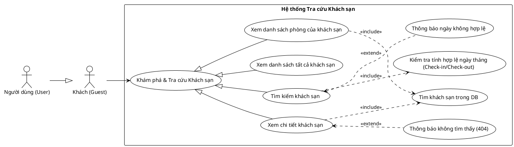

<!-- Mảnh Level-3 được tạo từ mục 3.2. Theo MEGA-DOCUMENT PROTOCOL, chỉnh sửa mặc định phải thực hiện tại mảnh này. Không tự ý chỉnh sửa PlantUML/code fence nếu tác vụ không yêu cầu. -->

#### 3.2.1.8 Usecase tra cứu khách sạn

> Hình 3.8: Usecase tra cứu khách sạn

Đặc tả Usecase xem danh sách tất cả khách sạn

| Mục | Nội dung |
| --- | --- |
| Tên Use case | Xem danh sách tất cả khách sạn |
| Actor | Khách (Guest), Người dùng (User) |
| Mô tả | Người dùng truy cập vào trang danh sách để xem toàn bộ các khách sạn hiện có trên hệ thống. |
| Pre-conditions | Actor truy cập vào trang chủ hoặc menu "Khách sạn" của hệ thống. |
| Post-conditions | Success: Hệ thống hiển thị danh sách các khách sạn với thông tin tóm tắt (Tên, Địa chỉ, Ảnh đại diện...). Fail: Hệ thống hiển thị danh sách trống hoặc báo lỗi kết nối. |
| Luồng sự kiện chính | 1. Actor chọn menu "Danh sách Khách sạn". 2. Hệ thống thực hiện truy vấn cơ sở dữ liệu để lấy danh sách khách sạn. 3. Hệ thống hiển thị danh sách khách sạn lên giao diện (có thể phân trang). |
| Luồng sự kiện phụ | - Nếu hệ thống chưa có dữ liệu khách sạn nào: Hệ thống hiển thị thông báo "Chưa có khách sạn nào trong hệ thống". |
| <Include Use Case> Quy trình Nghiệp vụ | - Truy vấn DB: (Ngầm định) Hệ thống lấy dữ liệu từ bảng Hotel để hiển thị cho người dùng. |
| <Extend Use Case> Thông báo lỗi không có quyền | Điều kiện: Khi quy trình kiểm tra quyền sở hữu trả về kết quả False (không khớp). Hành động: - Hệ thống hiển thị cảnh báo: "Bạn không có quyền chỉnh sửa khách sạn này". - Hệ thống từ chối lưu thay đổi. |
| <Extend Use Case> Thông báo thiếu ảnh | Điều kiện: Khi người dùng cố gắng lưu mà chưa có URL hình ảnh hợp lệ. Hành động: - Hệ thống hiển thị lỗi: "Vui lòng tải lên ít nhất một hình ảnh cho khách sạn". |

Đặc tả Usecase xem chi tiết khách sạn

| Mục | Nội dung |
| --- | --- |
| Tên Use case | Xem chi tiết khách sạn |
| Actor | Khách (Guest), Người dùng (User) |
| Mô tả | Người dùng xem toàn bộ thông tin chi tiết của một khách sạn cụ thể, bao gồm hình ảnh, địa chỉ, mô tả, danh sách tiện ích và các phòng thuộc khách sạn đó. |
| Pre-conditions | Actor đang ở trang danh sách khách sạn hoặc trang kết quả tìm kiếm. |
| Post-conditions | Success: Hệ thống hiển thị trang chi tiết khách sạn với đầy đủ thông tin. Fail: Hệ thống hiển thị trang lỗi 404 nếu ID khách sạn không tồn tại. |
| Luồng sự kiện chính | 1. Actor nhấn vào tên hoặc hình ảnh của một khách sạn trong danh sách. 2. Hệ thống thực hiện tìm khách sạn trong DB. 3. Nếu tìm thấy, hệ thống tải thông tin chi tiết (Info, Images, Amenities). 4. Hệ thống hiển thị giao diện chi tiết khách sạn. |
| Luồng sự kiện phụ | - Nếu ID khách sạn không tồn tại trong hệ thống (ví dụ: truy cập qua link cũ): Hệ thống thực hiện thông báo không tìm thấy (404). |
| <Include Use Case> Quy trình Nghiệp vụ | - Tìm khách sạn trong DB: Hệ thống thực hiện truy vấn cơ sở dữ liệu dựa trên ID khách sạn được cung cấp để lấy dữ liệu. |
| <Extend Use Case> Thông báo không tìm thấy (404) | Điều kiện: Khi quy trình tìm kiếm trả về kết quả rỗng. Hành động: - Hệ thống hiển thị thông báo lỗi: "Không tìm thấy khách sạn bạn yêu cầu". - Hệ thống cung cấp nút quay lại danh sách. |
| <Extend Use Case> Thông báo thiếu ảnh | Điều kiện: Khi người dùng cố gắng lưu mà chưa có URL hình ảnh hợp lệ. Hành động: - Hệ thống hiển thị lỗi: "Vui lòng tải lên ít nhất một hình ảnh cho khách sạn". |

Đặc tả Usecase tìm kiếm khách sạn

| Mục | Nội dung |
| --- | --- |
| Tên Use case | Tìm kiếm khách sạn |
| Actor | Khách (Guest), Người dùng (User) |
| Mô tả | Người dùng tìm kiếm khách sạn dựa trên các tiêu chí như địa điểm, ngày nhận phòng (Check-in) và ngày trả phòng (Check-out) để tìm nơi lưu trú phù hợp. |
| Pre-conditions | Actor đang ở trang chủ hoặc giao diện tìm kiếm của hệ thống. |
| Post-conditions | Success: Hệ thống hiển thị danh sách các khách sạn thỏa mãn tiêu chí tìm kiếm. Fail: Hệ thống báo lỗi nếu ngày tháng nhập vào không hợp lệ. |
| Luồng sự kiện chính | 1. Actor nhập địa điểm cần tìm và chọn ngày Check-in, Check-out. 2. Actor nhấn nút "Tìm kiếm". 3. Hệ thống thực hiện kiểm tra tính hợp lệ ngày tháng. 4. Nếu ngày hợp lệ, hệ thống thực hiện truy vấn danh sách khách sạn phù hợp trong cơ sở dữ liệu. 5. Hệ thống hiển thị kết quả tìm kiếm lên giao diện. |
| Luồng sự kiện phụ | - Nếu ngày Check-in/Check-out không đúng logic (ví dụ: ngày về trước ngày đi): Hệ thống thực hiện thông báo ngày không hợp lệ. |
| <Include Use Case> Quy trình Nghiệp vụ | - Kiểm tra tính hợp lệ ngày tháng: Hệ thống xác thực dữ liệu thời gian để đảm bảo ngày Check-in phải lớn hơn hoặc bằng hiện tại và nhỏ hơn ngày Check-out. |
| <Extend Use Case> Thông báo ngày không hợp lệ | Điều kiện: Khi quy trình kiểm tra ngày tháng phát hiện lỗi logic. Hành động: - Hệ thống hiển thị cảnh báo: "Ngày chọn không hợp lệ (Ngày trả phòng phải sau ngày nhận phòng)". - Hệ thống yêu cầu người dùng chọn lại ngày. |
| <Extend Use Case> Thông báo thiếu ảnh | Điều kiện: Khi người dùng cố gắng lưu mà chưa có URL hình ảnh hợp lệ. Hành động: - Hệ thống hiển thị lỗi: "Vui lòng tải lên ít nhất một hình ảnh cho khách sạn". |

Đặc tả Usecase xem danh sách phòng của khách sạn

| Mục | Nội dung |
| --- | --- |
| Tên Use case | Xem danh sách phòng của khách sạn |
| Actor | Khách (Guest), Người dùng (User) |
| Mô tả | Người dùng xem danh sách các phòng thuộc về một khách sạn cụ thể mà họ đang quan tâm. Danh sách này thường hiển thị ngay trong trang chi tiết khách sạn. |
| Pre-conditions | Actor đang ở trang chi tiết của một khách sạn cụ thể. |
| Post-conditions | Success: Hệ thống hiển thị danh sách các phòng của khách sạn đó (kèm giá, loại phòng, tình trạng...). Fail: Hệ thống báo lỗi nếu không tìm thấy dữ liệu khách sạn. |
| Luồng sự kiện chính | 1. Actor cuộn xuống phần "Danh sách phòng" hoặc nhấn nút "Xem phòng trống". 2. Hệ thống thực hiện tìm khách sạn trong DB (để lấy danh sách phòng liên kết). 3. Hệ thống hiển thị danh sách các phòng thuộc khách sạn đó lên giao diện. |
| Luồng sự kiện phụ | - Nếu ID khách sạn bị sai hoặc không tồn tại: Hệ thống thực hiện thông báo không tìm thấy (404). |
| <Include Use Case> Quy trình Nghiệp vụ | - Tìm khách sạn trong DB: Hệ thống truy vấn cơ sở dữ liệu để lấy danh sách các bản ghi Phòng (Room) có hotel_id khớp với khách sạn đang xem. |
| <Extend Use Case> Thông báo không tìm thấy (404) | Điều kiện: Khi ID khách sạn không hợp lệ trong quá trình truy vấn. Hành động: - Hệ thống hiển thị thông báo lỗi dữ liệu hoặc chuyển hướng về trang danh sách. |
| <Extend Use Case> Thông báo thiếu ảnh | Điều kiện: Khi người dùng cố gắng lưu mà chưa có URL hình ảnh hợp lệ. Hành động: - Hệ thống hiển thị lỗi: "Vui lòng tải lên ít nhất một hình ảnh cho khách sạn". |
