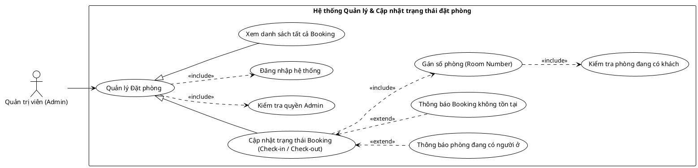

<!-- Mảnh Level-3 được tạo từ mục 3.2. Theo MEGA-DOCUMENT PROTOCOL, chỉnh sửa mặc định phải thực hiện tại mảnh này. Không tự ý chỉnh sửa PlantUML/code fence nếu tác vụ không yêu cầu. -->

#### 3.2.1.9 Usecase quản lý đặt phòng

> Hình 3.9: Usecase quản lý đặt phòng

Đặc tả Usecase xem danh sách tất cả Booking

| Mục                                       | Nội dung                                                                                                                                                                                                                      |
| ----------------------------------------- | ----------------------------------------------------------------------------------------------------------------------------------------------------------------------------------------------------------------------------- |
| Tên Use case                              | Xem danh sách tất cả Booking                                                                                                                                                                                                  |
| Actor                                     | Quản trị viên (Admin)                                                                                                                                                                                                         |
| Mô tả                                     | Admin truy cập vào hệ thống để xem toàn bộ danh sách các đơn đặt phòng (Booking) nhằm theo dõi tình hình kinh doanh và quản lý.                                                                                               |
| Pre-conditions                            | - Actor đã đăng nhập vào hệ thống. - Actor có quyền Admin.                                                                                                                                                                 |
| Post-conditions                           | Success: Hệ thống hiển thị danh sách các Booking với thông tin chi tiết (Khách hàng, Phòng, Ngày, Trạng thái...). Fail: Hệ thống báo lỗi không có quyền truy cập.                                                          |
| Luồng sự kiện chính                       | 1. Actor chọn chức năng "Quản lý Đặt phòng" trên menu. 2. Hệ thống thực hiện kiểm tra quyền Admin. 3. Nếu hợp lệ, hệ thống truy vấn dữ liệu các đơn đặt phòng. 4. Hệ thống hiển thị danh sách Booking lên giao diện. |
| Luồng sự kiện phụ                         | - Nếu Actor không phải Admin: Hệ thống từ chối truy cập và báo lỗi.                                                                                                                                                           |
| <Include Use Case> Quy trình Nghiệp vụ | - Kiểm tra quyền Admin: Hệ thống xác minh vai trò của tài khoản hiện tại để đảm bảo tính bảo mật cho module quản lý.                                                                                                          |

Đặc tả Usecase cập nhật trạng thái Booking

| Mục | Nội dung |
| --- | --- |
| Tên Use case | Cập nhật trạng thái Booking |
| Actor | Quản trị viên (Admin) |
| Mô tả | Admin thay đổi trạng thái của đơn đặt phòng (ví dụ: từ "Đã đặt" sang "Check-in" hoặc "Check-out"). Khi Check-in, Admin cần gán số phòng cụ thể cho khách. |
| Pre-conditions | - Actor đã đăng nhập và có quyền Admin. - Đơn đặt phòng cần xử lý phải tồn tại trong hệ thống. |
| Post-conditions | Success: Trạng thái Booking được cập nhật, số phòng được gán (nếu Check-in). Fail: Hệ thống báo lỗi nếu phòng đã có người ở hoặc Booking không tìm thấy. |
| Luồng sự kiện chính | 1. Actor chọn một Booking cụ thể và nhấn "Cập nhật" (hoặc Check-in/Check-out). 2. Actor nhập/chọn số phòng (nếu thực hiện Check-in). 3. Hệ thống thực hiện gán số phòng. 4. Hệ thống thực hiện kiểm tra phòng đang có khách. 5. Nếu phòng trống và hợp lệ, hệ thống lưu trạng thái mới cho Booking. 6. Hệ thống thông báo cập nhật thành công. |
| Luồng sự kiện phụ | - Nếu phòng được chọn đang có người ở (Occupied): Hệ thống thực hiện thông báo phòng đang có người ở. - Nếu Booking không tồn tại (do bị xóa trước đó): Hệ thống thực hiện thông báo Booking không tồn tại. |
| <Include Use Case> Quy trình Xử lý | - Gán số phòng: Hệ thống liên kết mã phòng cụ thể với đơn đặt phòng hiện tại. - Kiểm tra phòng đang có khách: Hệ thống kiểm tra trạng thái thực tế của phòng trong khoảng thời gian đó để tránh trùng lặp (Double Booking). |
| <Extend Use Case> Thông báo phòng đang có người ở | Điều kiện: Khi quy trình kiểm tra phòng phát hiện phòng đã có khách hoặc chưa dọn dẹp. Hành động: - Hệ thống hiển thị cảnh báo: "Phòng này đang có người ở hoặc không khả dụng". - Hệ thống yêu cầu chọn phòng khác. |
| <Extend Use Case> Thông báo Booking không tồn tại | Điều kiện: Khi ID của Booking không tìm thấy trong cơ sở dữ liệu. Hành động: - Hệ thống báo lỗi và quay lại danh sách. |
