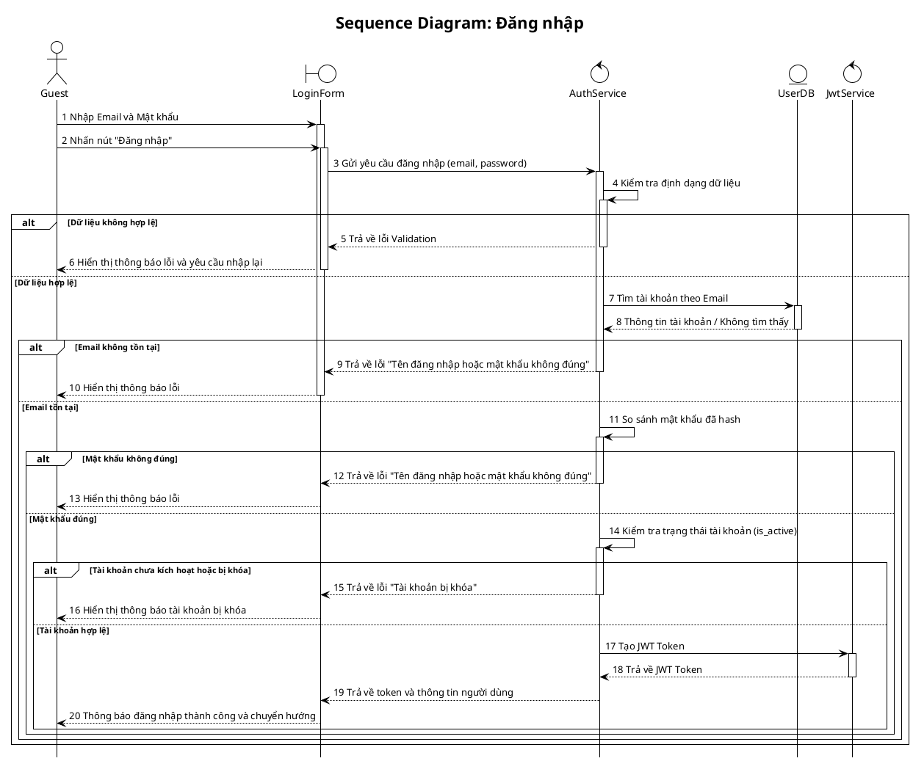

<ai_context>
File này là mảnh Level-3 thuộc mục 3.2. Chứa Sơ đồ tuần tự cho chức năng Đăng nhập.
</ai_context>

<system_instruction>
TUYỆT ĐỐI KHÔNG tự ý thay đổi, xóa, định dạng lại mã nguồn PlantUML hoặc code fence trừ khi tác vụ yêu cầu đích danh việc sửa sơ đồ.
</system_instruction>

> Hình 3.13: Sơ đồ tuần tự đăng nhập

- Sơ đồ tuần tự đăng nhập

