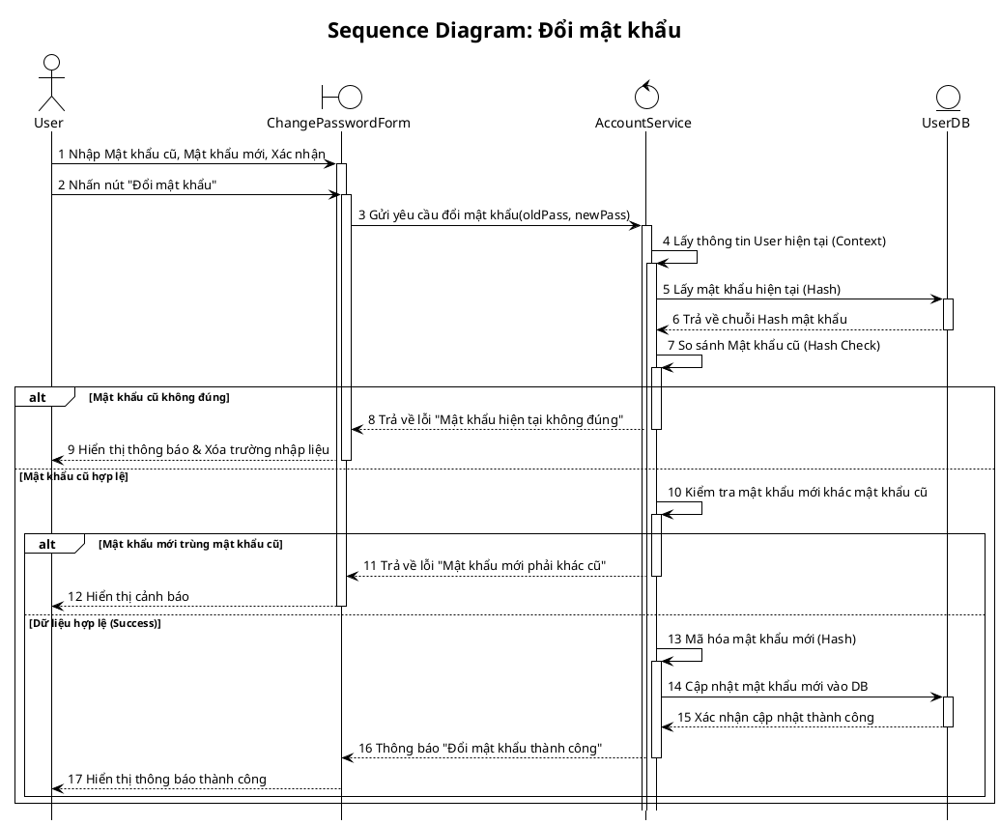

<!-- Mảnh Level-3 được tạo từ mục 3.2. Theo MEGA-DOCUMENT PROTOCOL, chỉnh sửa mặc định phải thực hiện tại mảnh này. Không tự ý chỉnh sửa PlantUML/code fence nếu tác vụ không yêu cầu. -->

> Hình 3.15: Sơ đồ tuần tự cập nhật thông tin cá nhân

- Sơ đồ tuần tự đổi mật khẩu

