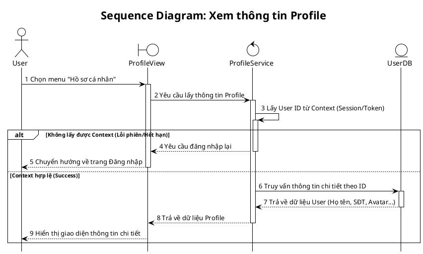

<!-- Mảnh Level-3 được tạo từ mục 3.2. Theo MEGA-DOCUMENT PROTOCOL, chỉnh sửa mặc định phải thực hiện tại mảnh này. Không tự ý chỉnh sửa PlantUML/code fence nếu tác vụ không yêu cầu. -->

> Hình 3.16: Sơ đồ tuần tự đổi mật khẩu

- Sơ đồ tuần tự xem thông tin profile

