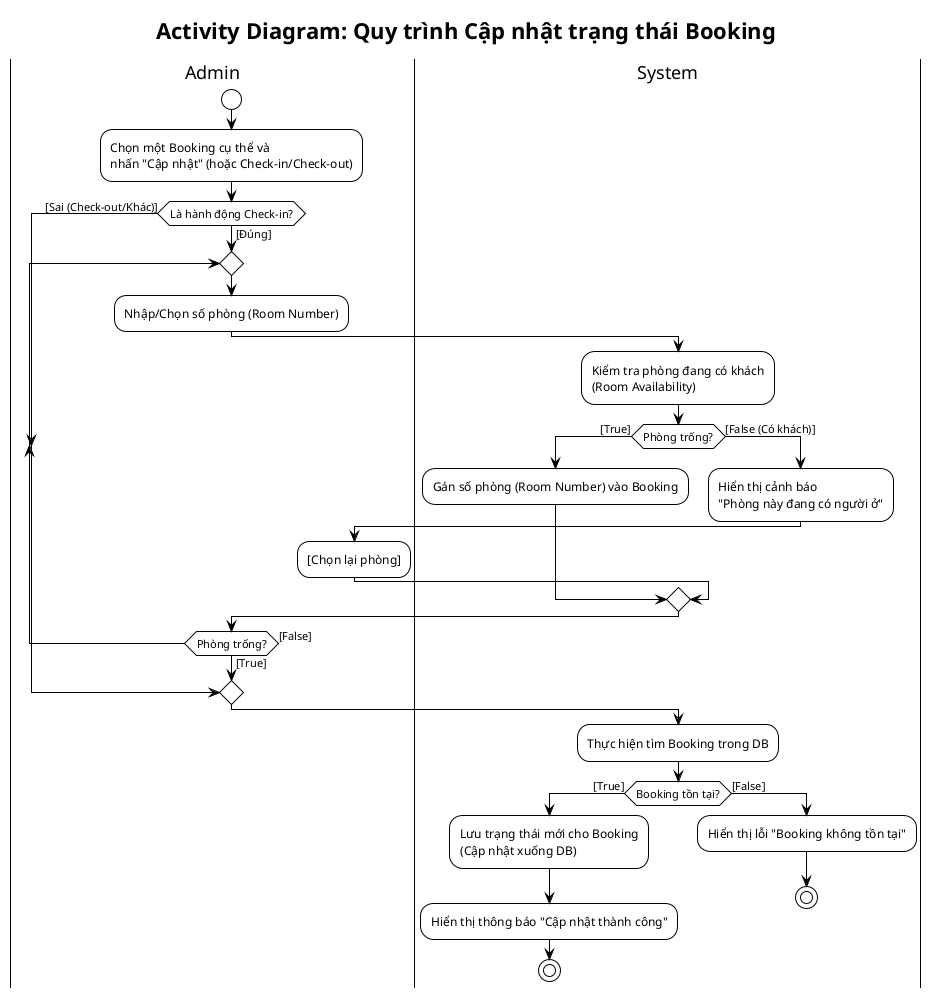

<!-- Mảnh Level-3 được tạo từ mục 3.2. Theo MEGA-DOCUMENT PROTOCOL, chỉnh sửa mặc định phải thực hiện tại mảnh này. Không tự ý chỉnh sửa PlantUML/code fence nếu tác vụ không yêu cầu. -->

> Hình 3.75: Sơ đồ hoạt động xem danh sách tất cả Booking

- Sơ đồ hoạt động cập nhật trạng thái Booking

