<!-- Mảnh file được tạo từ 03_thiet_ke.md. Theo MEGA-DOCUMENT PROTOCOL, chỉnh sửa mặc định phải thực hiện tại mảnh này, không chỉnh file chương gốc. -->

## 3.3 Hệ thống màn hình

- Giao diện đăng nhập

> Hình 3.85: Giao diện đăng nhập

- Giao diện đăng ký

> Hình 3.86: Giao diện đăng ký

- Giao diện trang chủ

> Hình 3.87: Giao diện trang chủ

- Giao diện xem tất cả khách sạn

> Hình 3.88: Giao diện xem tất cả khách sạn

- Giao diện xem chi tiết khách sạn

> Hình 3.89: Giao diện xem chi tiết khách sạn

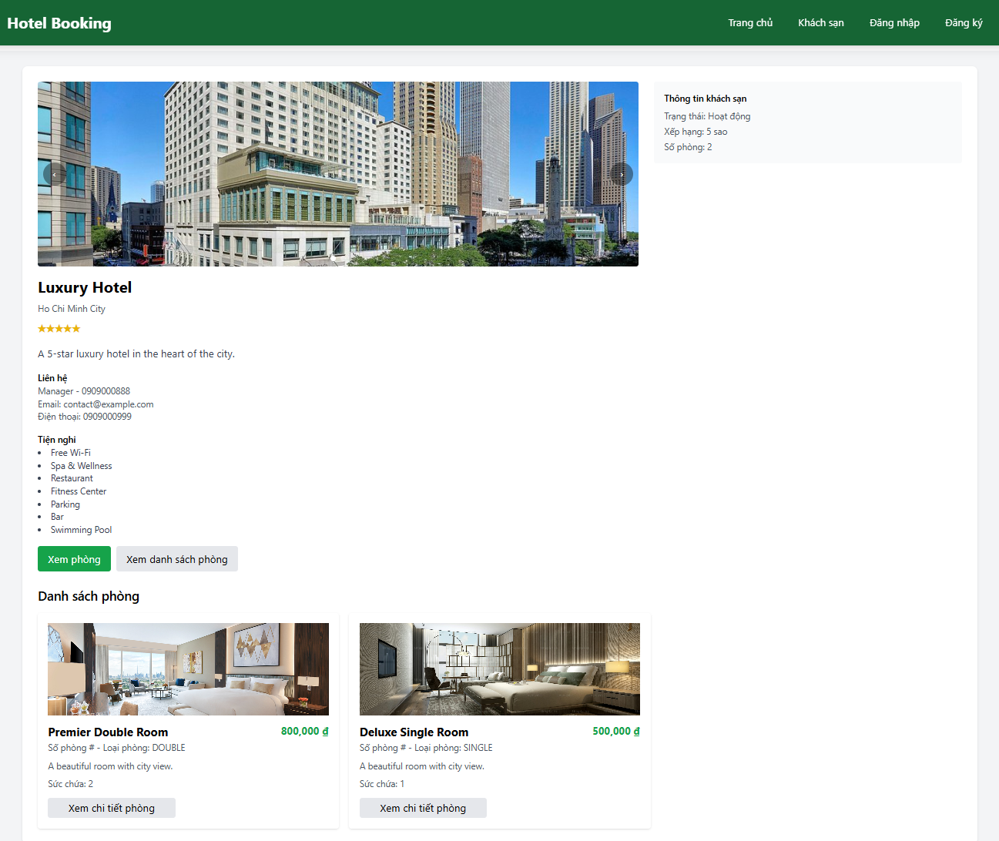
- Giao diện xem phòng của một khách sạn

> Hình 3.90: Giao diện xem phòng của một khách sạn

- Giao diện xem chi tiết thông tin phòng và form đặt phòng

> Hình 3.91: Giao diện xem chi tiết thông tin phòng và form đặt phòng

- Giao diện đặt phòng thành công

> Hình 3.92: Giao diện đặt phòng thành công

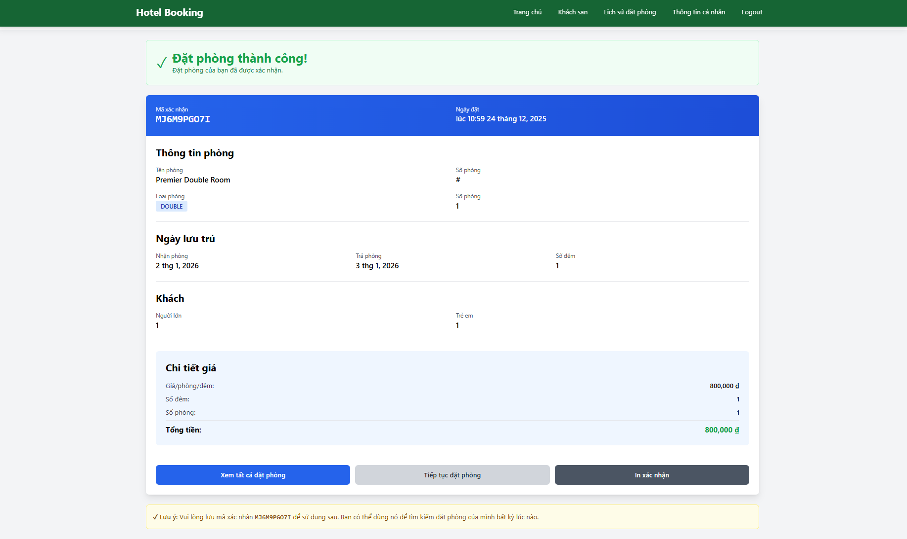

- Giao diện lịch sử đặt phòng và tìm kiếm

> Hình 3.93: Giao diện lịch sử đặt phòng và tìm kiếm

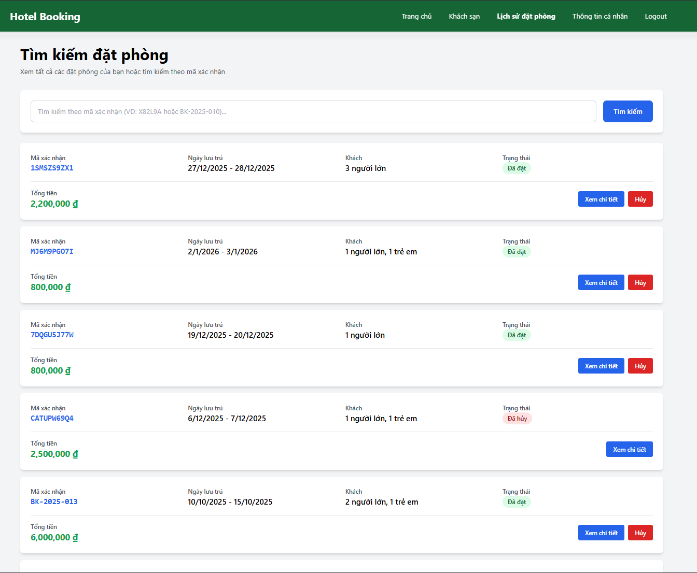

- Giao xem chi tiết thông tin đặt phòng

> Hình 3.94: Giao xem chi tiết thông tin đặt phòng

- Giao diện khi chọn hủy đặt phòng:

> Hình 3.95: Giao diện khi chọn hủy đặt phòng

- Giao diện thông tin cá nhân (thông tin cá nhân và thay đổi mật khẩu)

> Hình 3.96: Giao diện thông tin cá nhân

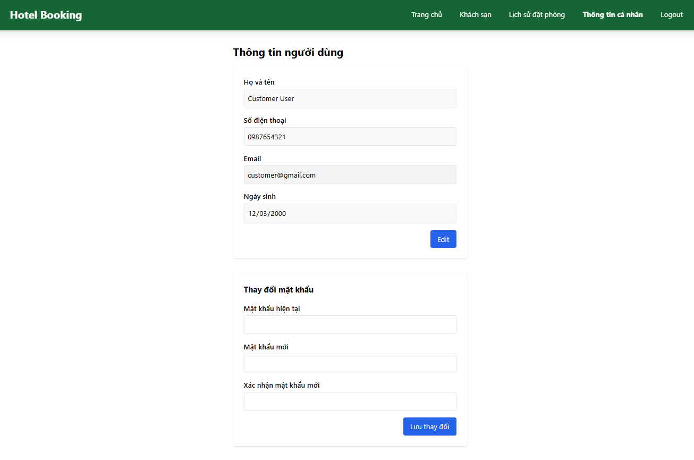

- Giao diện chính trang quản trị (Quản trị viên)

> Hình 3.97: Giao diện chính trang quản trị

- Giao diện quản lý tài khoản (Quản trị viên)

> Hình 3.98: Giao diện quản lý tài khoản

- Giao diện quản lý khách sạn (Quản trị viên)

> Hình 3.99: Giao diện quản lý khách sạn

- Giao diện khi nhấn vào “Quản lý” của một khách sạn cụ thể

> Hình 3.100: Giao diện khi nhấn vào “Quản lý” của một khách sạn cụ thể

- Giao diện quản lý phòng của một khách sạn

> Hình 3.101: Giao diện quản lý phòng của một khách sạn

- Giao diện thêm một phòng mới cho khách sạn hiện tại

> Hình 3.102: Giao diện thêm một phòng mới cho khách sạn hiện tại

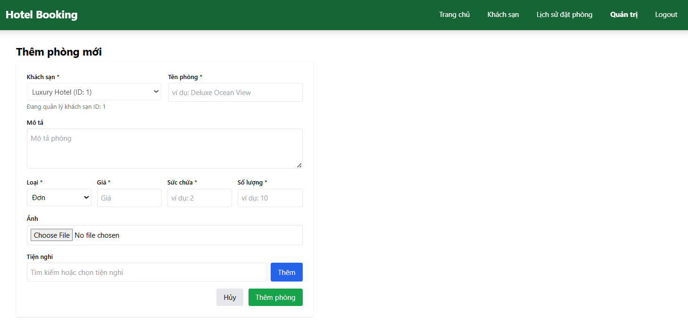

- Giao diện chỉnh sửa phòng

> Hình 3.103: Giao diện chỉnh sửa phòng

- Giao diện xác nhận khi xóa một phòng

> Hình 3.104: Giao diện xác nhận khi xóa một phòng

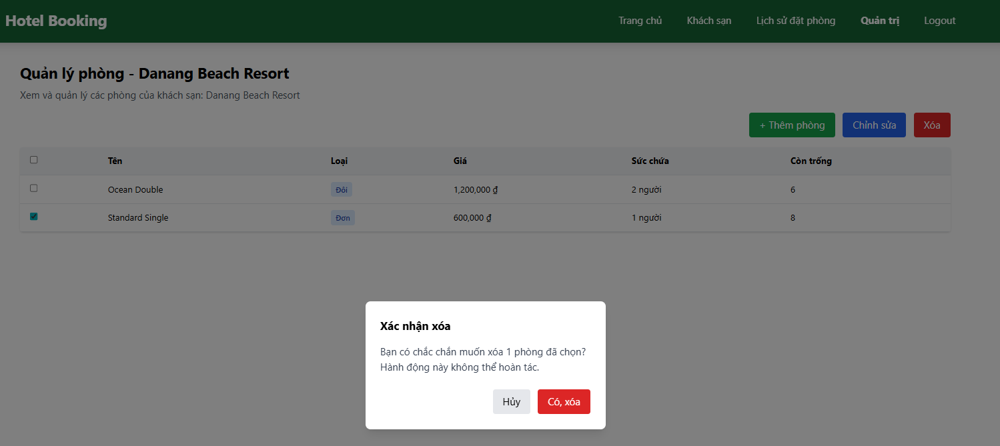

- Giao diện thêm mới một khách sạn (Quản trị viên)

> Hình 3.105: Giao diện thêm mới một khách sạn

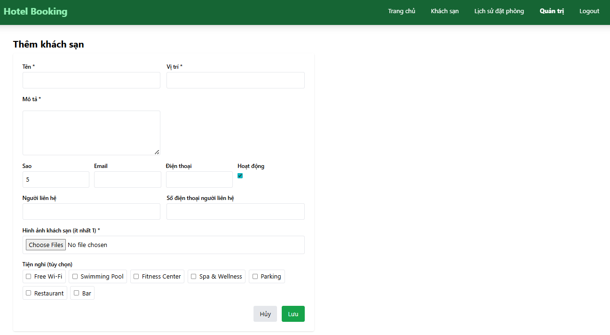

- Giao diện chỉnh sửa một khách sạn (Quản trị viên)

> Hình 3.106: Giao diện chỉnh sửa một khách sạn

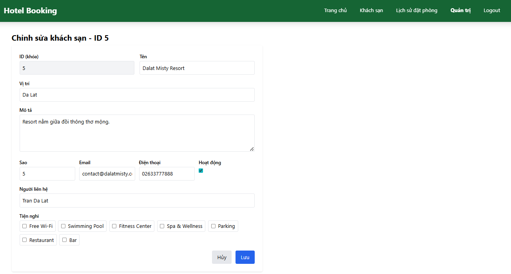

- Giao diện xác nhận trước khi xóa một khách sạn (Quản trị viên)

> Hình 3.107: Giao diện xác nhận trước khi xóa một khách sạn

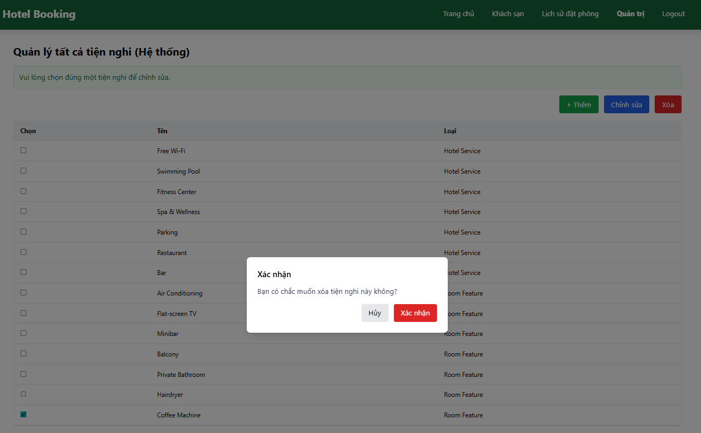

- Giao diện quản lý và tìm kiếm đặt phòng (Quản trị viên)

> Hình 3.108: Giao diện quản lý và tìm kiếm đặt phòng

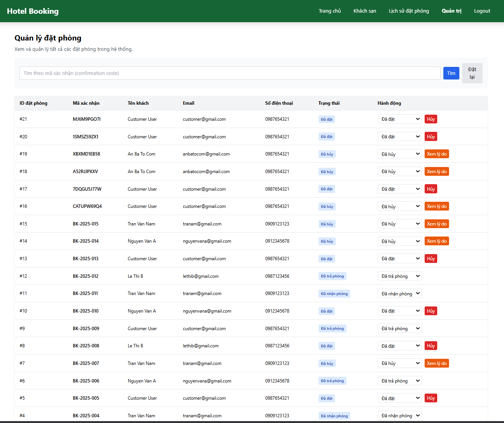

- Giao diện chuyển đổi trạng thái nhận từ “đã đặt” thành “đã nhận phòng”

> Hình 3.109: Giao diện chuyển đổi trạng thái nhận từ “đã đặt” thành “đã nhận phòng”

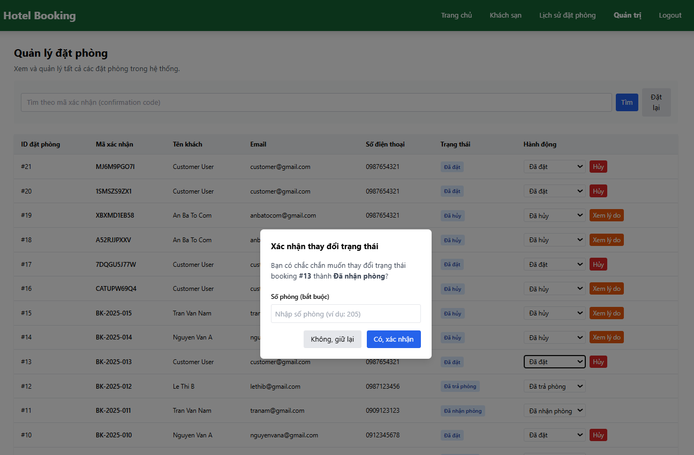

- Giao diện quản lý tiện nghi (Quản trị viên)

> Hình 3.110: Giao diện quản lý tiện nghi

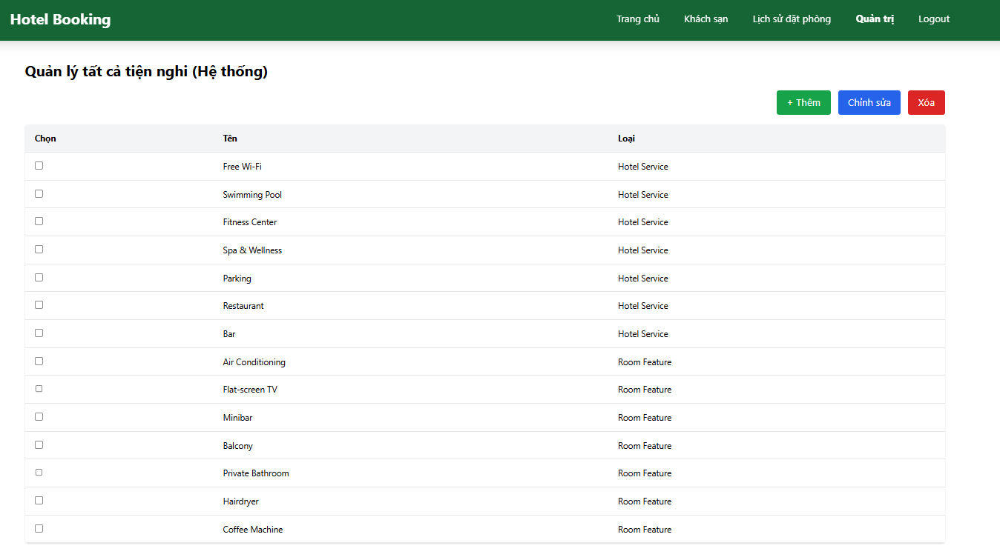

- Giao diện thêm mới một tiện nghi (Quản trị viên)

> Hình 3.111: Giao diện thêm mới một tiện nghi

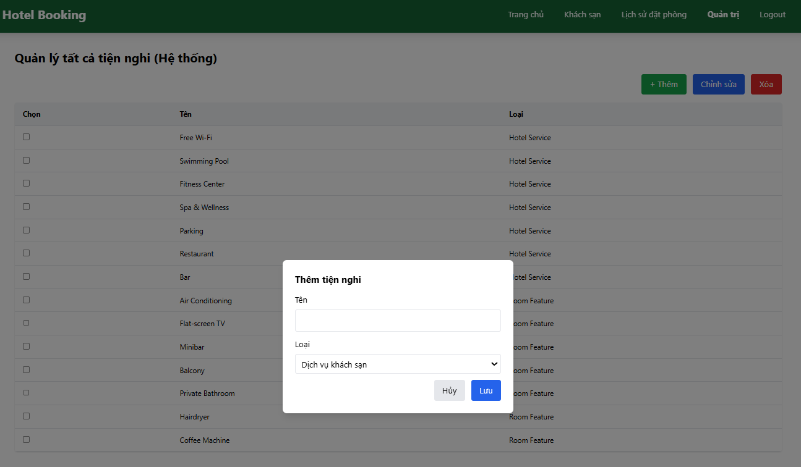

- Giao diện chỉnh sửa một tiên nghi

> Hình 3.112: Giao diện chỉnh sửa một tiên nghi

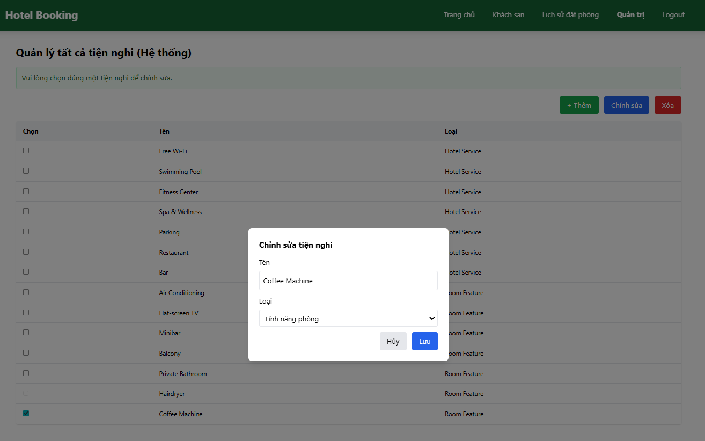

- Giao diện xác nhận xóa một tiện nghi

> Hình 3.113: Giao diện xác nhận xóa một tiện nghi

- Giao diện xem tất cả tiện nghi các cấp của một khách sạn

> Hình 3.113: Giao diện xem tất cả tiện nghi các cấp của một khách sạn

